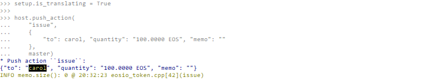

# Symbolic Names

This document demonstrates how *EOSFactory* uses symbolic names to handle *EOSIO* accounts and display logger messages.

## Context

*EOSIO* accounts are indexed by their names, thus those names have to be unique within the blockchain namespace and have to follow specific restrictions. As a result, most of the human readable combinations are already taken, even in a testnet environment, so we need to resort to random names when registering new accounts on the blockchain.

With *EOSFactory*, the actual accounts registered on a blockchain are wrapped in Python objects initialized via the `create_account` command. This allows us to hide the actual name of an *EOSIO* account behind an alias equal to the name of a Python variable referencing the account object.

The mapping between actual accounts and their *EOSFactory* representations is cached locally in a file. As a result, what we achieve is consistent testing environment across separate Python sessions.

What's more, *EOSFactory* translates *EOSIO* logger messages, so that the random account names are replaced with human-readable *EOSFactory* aliases.

## Use Case

Create a new Python session and import *EOSFactory* API:

```
$ python3
```

```
from eosfactory.eosf import *
```

Then run this code to initialize a local testnet, register a couple of accounts and deploy a smart-contract to one of them:

```
reset()
create_master_account("master")
create_account("host", master)
create_account("alice", master)
create_account("carol", master)

contract = Contract(host, "02_eosio_token")
contract.build(force=False)
contract.deploy()

host.push_action(
    "create", 
    {
        "issuer": master,
        "maximum_supply": "1000000000.0000 EOS",
        "can_freeze": "0",
        "can_recall": "0",
        "can_whitelist": "0"
    }, [master, host])
```

#### Symbolic translation disabled

Next, turn symbolic translation OFF:

```md
setup.is_translating = False
```

And push an action to the smart-contract:

```md
host.push_action(
    "issue",
    {
        "to": alice, "quantity": "100.0000 EOS", "memo": ""
    },
    master)
```
Here is the expected outcome:


Please note that when symbolic translation is disabled, the logger output referes to the `alice` account as `x32uuciixv4p`. It's because this is the actual name of this account as registered on the blockchain.

#### Symbolic translation enabled

Now, turn symbolic translation ON:

```md
setup.is_translating = True
```
And push another action to the same smart-contract:

```md
host.push_action(
    "issue",
    {
        "to": carol, "quantity": "100.0000 EOS", "memo": ""
    },
    master)
```

Here is the expected outcome:



Please note that when symbolic translation is enabled, the human-readable name `carol` is used in the logger output, even though the actual name of this account is `d4okdmdcqt4w`.

Finally, stop the local testnet and exit Python CLI:

```
stop()
exit()
```

## Test run

The examples presented in this document can be executed as a Python script:

```
python3 docs/sphinx/source/cases/03_symbolic_names/case.py
```

You should get output similar to this:

