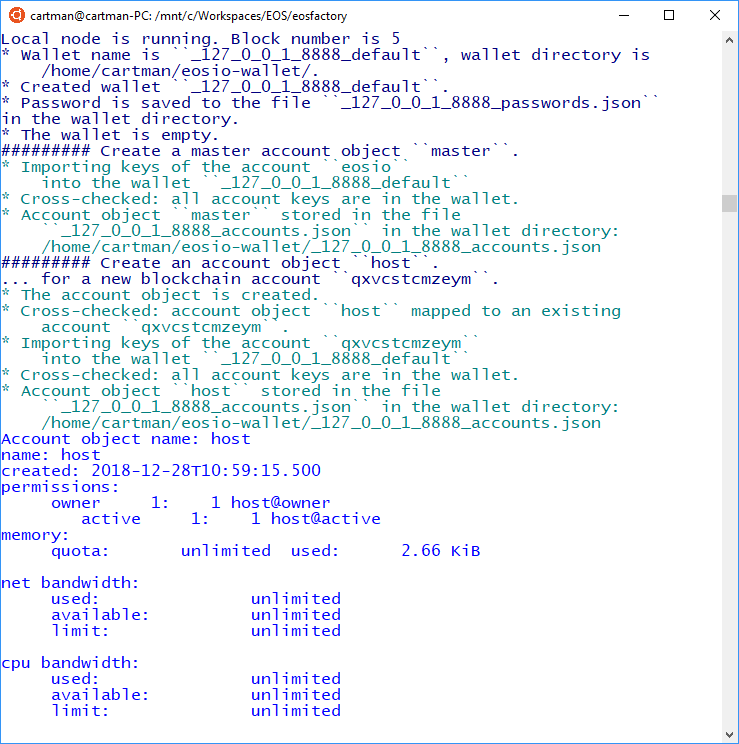

# Account Object

This case demonstrates how the concept of EOSIO account is applied in *EOSFactory*.
We present how to create an account object, associate it with a contract and then execute some actions of this contract.

## Context

*EOSFactory* wraps *EOSIO* accounts using Python objects, i.e. instances of the `eosfactory.shell.account.Account` class. The mapping between actual accounts and their *EOSFactory* representations is cached locally in a file. As a result, we achieve consistent testing environment across separate Python sessions.

## Use Case

The python blocks in the current Markdown document can be executed with a provided bash tool. While the working directory is the root of the `EOSFactory` installation, do:

```bash
eosfactory/pythonmd.sh docs/cases/account.md
```

### Create a new account

Create a new Python session and import *EOSFactory* API:

```bash
python3
```

```python
from eosfactory.eosf import *
```

Start a local testnet, create a wallet and then create a special master account referenced by a global variable called `master`:

```python
reset()
create_master_account("master")
```

Next, use the `master` account to create another account referenced by a global variable called `host`:

```python
create_account("host", master)
```

The first argument is the name of variable to be created, the second one points to the `master` account, which we created in the previous step.

You can verify that the variable exists and its methods can be invoked, for example:

```python
host.info()
```

Here is the expected outcome:



The `create_account` command performs several tasks:

* verifies that a `Wallet` object exist in the namespace,
* verifies that the proposed variable name is not already taken,
* registers a new account on the testnet - this account has its own name generated randomly,
* using the proposed name, creates a global variable referencing the actual account on the testnet,
* opens the wallet, unlocks it and stores the account's private keys into it,
* and finally, updates its internal statistics tracking all accounts created in a similar way.

All the above actions are logged to the terminal, which can be visible, provided the verbosity is set to its default value.

### Methods of the Account class

An instance of the `Account` class has the following methods:

* `info()` - list the account's information,
* `push_action()` - push an action to the smart-contract,
* `show_action()` - display a `JSON` file of a transaction without sending it to the blockchain,
* `table()` - list the content of the local database associated with the smart-contract.

**NOTE:** the `master` account is an instance of a different class (i.e. the `AccountMaster` class) which does not implement the above methods. As a consequence, you cannot associate a smart-contract with an instance of the `AccountMaster` class.

### Create a contract object

Create an instance of the `Contract` class and associate it with the `host` account:

```python
contract = Contract(host, "01_hello_world")
```

The second argument of the creator of the `Contract` class identifies the location of the contract's source code (you can supply the entire path, but in case of standard locations, e.g. *EOSFactory* demo contracts or your predefined workspace, you can just specify the folder name).

Next, let's build and deploy the contract:

```python
contract.build()
contract.deploy()
```

### Execute the contract

If the deployment succeeds, the contract can be executed.

First, create two accounts - `alice` and `carol`:

```python
create_account("alice", master)
create_account("carol", master)
```

And then you can push actions of the contract stored at the `host` account, using those two other accounts as arguments:

```python
host.push_action("hi", {"user":alice}, alice)
host.push_action("hi", {"user":carol}, carol)
```

You can also try the `show_action` method:

```python
host.show_action("hi", {"user":alice}, alice)
```

**NOTE:** As the `01_hello_world` does not define any tables, in this case the `table` method will not work.

Here is the expected outcome:


Finally, stop the local testnet and exit Python CLI:

```python
stop()
```

### Test run

The python blocks in the current Markdown document can be executed with a provided bash tool. While the working directory is the root of the `EOSFactory` installation, do:

```bash
eosfactory/pythonmd.sh docs/cases/account.md
```