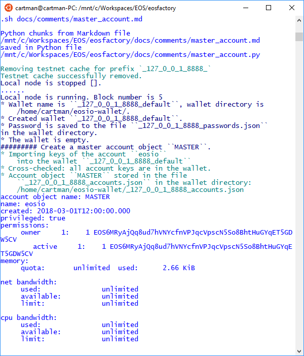
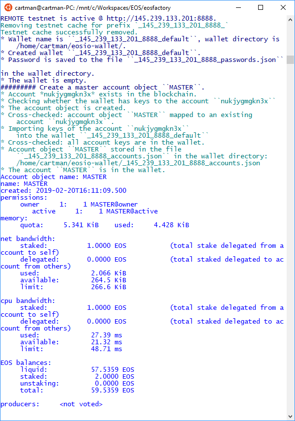
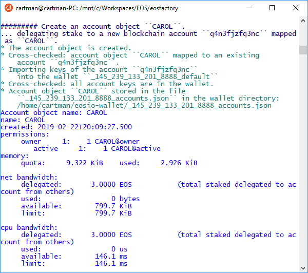

# MASTER Account Object

*EOSFactory* wraps *EOSIO* accounts using Python objects, i.e. instances of the `Account` class. A MASTER account is also an instance of the `Account` class, but it plays a special role in *EOSFactory*: it spawns other accounts into existence.

The implementation of a MASTER account is dependent on the context:

* On a local (private) testnet the MASTER account refers to the `eosio` super account. As such, it has limited capabilities, e.g. it cannot be associated with a smart-contract.
* On a remote (public) testnet the MASTER account refers to the initial account created by the user manually. It behaves like a normal account, apart from the fact that it is used to sponsor the creation of other accounts.

Let's consider two scenarios: first a local (private) testnet, and then a more complex situation of a remote (public) testnet.

## Local testnet

Create a new Python session and import *EOSFactory* API:

```bash
python3
```

```python
from eosfactory.eosf import *
```

First, let's start a local testnet:

```python
reset()
```

Next, we create a wallet and then we use the `create_master_account` command to create a global variable named `MASTER` referencing the `eosio` account.

```python
create_master_account("MASTER")
MASTER.info()
```
Here is the expected outcome:



And finally, we show how the `MASTER` variable can be used to create other accounts:

```python
create_account("ALICE", MASTER)
ALICE.info()
```

## Remote testnet

Create a new Python session and import *EOSFactory* API:

```bash
python3
```

```python
from eosfactory.eosf import *
```

First, we need to define a remote testnet and pass to *EOSFactory* the data of the account we control there:

```python
testnet = Testnet(
    "nukjygmgkn3x",
    "5KXxczFPdcsLrCYpRRREfd4e2xVDTZZqBpZWmvxLZYxUbPzqrWL",
    "5KJLMupynNYFiM9gZWtDnDX55hbaF18EsWpFr8UvyJeADqbwN7A",
    "http://145.239.133.201:8888"
    )
```

We supply four parameters:

- an URL of a public node offering access to the testnet, e.g. `http://145.239.133.201:8888`,
- the name of an existing account on this testnet, e.g. `nukjygmgkn3x`,
- the account's owner & active private keys.

Next, we let *EOSFactory* configure and verify the testnet:

```python
testnet.configure()
testnet.verify_production()
testnet.clear_cache()
```

Then, we proceed to create a global variable named `MASTER` referencing the remote testnet account:

```python
create_master_account("MASTER", testnet)
MASTER.info()
```

**NOTE:** In this case the `create_master_account` command takes an extra parameter, i.e. the reference to the remote testnet.

And finally, we show how the `MASTER` variable can be used to create other accounts:

```python
create_account("CAROL", MASTER, buy_ram_kbytes=8, stake_net=3, stake_cpu=3)
CAROL.info()
```

**NOTE:** You might want to tweak with the extra parameters, i.e. `buy_ram_kbytes`, `stake_net` and `stake_cpu`.

Here is the expected outcome:




## Test run

The python blocks in the current Markdown document can be executed with a provided bash tool. While the working directory is the root of the `EOSFactory` installation, do:

```bash
eosfactory/pythonmd.sh docs/comments/master_account.md
```
