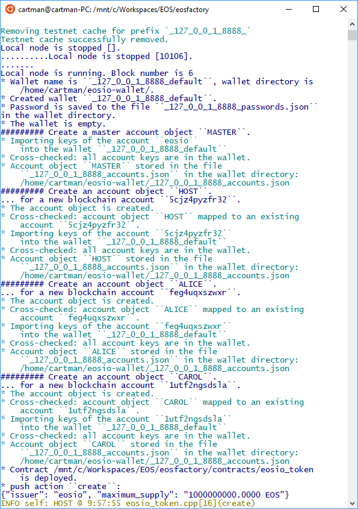
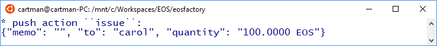

# Symbolic Names

*EOSIO* accounts are indexed by their names, thus those names have to be unique within the blockchain namespace and have to follow specific restrictions. As a result, most of the human readable combinations are already taken, even in a testnet environment, so we need to resort to random names when registering new accounts on the blockchain.

With *EOSFactory*, the actual accounts registered on a blockchain are wrapped in Python objects initialized via the `create_account` command. This allows us to hide the actual name of an *EOSIO* account behind an alias equal to the name of a Python variable referencing the account object.

The mapping between actual accounts and their *EOSFactory* representations is cached locally in a file. As a result, what we achieve is consistent testing environment across separate Python sessions.

What's more, *EOSFactory* translates *EOSIO* logger messages, so that the random account names are replaced with human-readable *EOSFactory* aliases.

Create a new Python session and import *EOSFactory* API:

```bash
$ python3
```

```python
from eosfactory.eosf import *
```

Then run this code to initialize a local testnet, register a couple of accounts and deploy a smart-contract to one of them:

```python
reset()

create_master_account("MASTER")
create_account("HOST", MASTER)
create_account("ALICE", MASTER)
create_account("CAROL", MASTER)

smart = Contract(HOST, "eosio_token")
smart.build(force=False)
smart.deploy()

HOST.push_action(
    "create", 
    {
        "issuer": MASTER,
        "maximum_supply": "1000000000.0000 EOS"
    }, [MASTER, HOST])
```

## Symbolic translation disabled

Next, turn symbolic translation OFF:

```python
setup.is_translating = False
```

And push an action to the smart-contract:

```python
HOST.push_action(
    "issue",
    {
        "to": ALICE, "quantity": "100.0000 EOS", "memo": ""
    },
    MASTER)
```
Here is the expected outcome:



Please note that when symbolic translation is disabled, the logger output refers to the `ALICE` account as `v13zgjp3bu45`. It's because this is the actual name of this account as registered on the blockchain.

## Symbolic translation enabled

Now, turn symbolic translation ON:

```python
setup.is_translating = True
```
And push another action to the same smart-contract:

```python
HOST.push_action(
    "issue",
    {
        "to": CAROL, "quantity": "100.0000 EOS", "memo": ""
    },
    MASTER)
```

Here is the expected outcome:



Please note that when symbolic translation is enabled, the human-readable name `CAROL` is used in the logger output, even though the actual name of this account is `d4okdmdcqt4w`.

Finally, stop the local testnet and exit Python CLI:

```python
stop()
```

## Test run

The python blocks in the current Markdown document can be executed with a provided bash tool. While the working directory is the root of the `EOSFactory` installation, do:

```bash
eosfactory/pythonmd.sh docs/comments/symbolic_names.md
```
