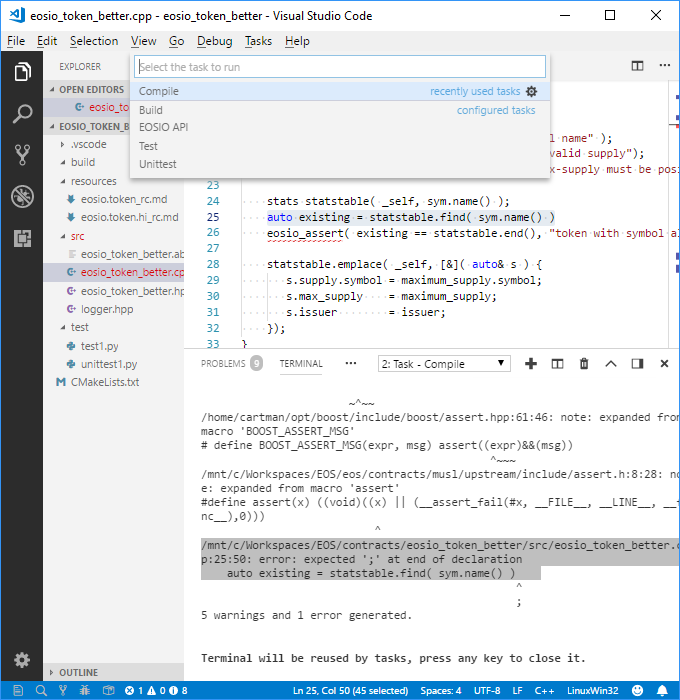

# Visual Studio Code IDE for EOSIO smart contracts

```md
The ``Visual Studio Code`` is the base upon which we develop the ``EOSFactory``.
Although you can use the Factory with a plain bash terminal, we strongly 
recommend using the VScode instead: it can add new dimensions to your 
experience with the Factory. 

Let us assume that you have the VScode installed.

For us, the ``EOSFactory`` is about an Integrated Development Environment for
the EOSIO smart contract.
```
## Smart contract templates

```md
The Factory provides smart contract templates that may be used a start point 
for development of your own task. For example, you can launch a smart contract 
named ``eosio_token_better``:

    * starting with the original EOSIO code of the ``eosio.token``, 
    * with its root at your workspace directory, for example, 
        ``/mnt/c/Workspaces/EOS/contracts``.

If you omit the workspace directory argument, this one set with the installation 
of the Factory will be used.

Use a bash terminal, it can be one belonging to an instance of the VScode: 
```
```md
$ $eosf template create eosio_token_better eosio.token\
    --workspace /mnt/c/Workspaces/EOS/contracts --vsc
```
```md
We hope that you see an instance of the VScode window now.
```
## IDE workspace

```md
If you cannot find in the workspace anything that you need for your work, we 
will try to add it in the next editions. Now, you can see the following items:

    * ``src`` directory, the cpp and hpp files are there.
    * ``test`` directory, test scripts are there.
    * ``resources`` directory, everything that does not fit to the previous two
        goes there. Now, it contains the Ricardian contract files.
    * ``.vscode`` directory that contains intellisense definitions, task 
        definitions, etc.
    * ``CMakeLists.txt`` file, CMake definitions.

Also, you can see the ``Tasks`` dialog window:

    * ``Build`` results in building the contract, resulting ``ABI`` and ``WAST``
        files go to the ``build`` directory.
    * ``Compile`` results in compilation of the contract, without building
        (neither ``ABI`` nor ``WAST`` are produced), but code errors, if any,
        are listed.
    * ``EOSIO API`` results in opening (in the default browser) of the EOSIO
        manual.
    * ``Test`` - executes the ``test1`.py`` script.
    * ``Unittest`` - executes the ``unittest1`.py`` script.

Note that you can edit the literals. For example, if you change the test
name ``test1``, you have to update both ``CMakeLists.txt`` and 
``.vscode/tasks.json`` files.
```


## Working on the code

```md
The VScode provides the intelisense and easy access to the context. Especially,
you can inspect any context code. The list of services is:
    * Go to Definition.
    * Pick Definition.
    * Go to Declaration.
    * Pick Declaration.

In the image below, you cen see a result of the ``Pick Definition`` service. 
```


## Developing the code of the contract
```md
A very sophisticated C/CPP development environment is now at your disposal,
however, you can write errors that can be found with the compiler. Use the 
``Compile`` task. See an exemplary result, in the image below.

There you can see a missing semicolon in the editor pane. (The shading is not
automatic.) Also, you can see the error message in the task panel. 
(Again, the shading is not automatic.) 
```


## Building the contract
```md
You can build the contract in two ways:

    * Use the task ``Build``.
    * Use the CMake.

The image below shows the CMake way. The result of the build process goes to
the ``build`` directory.

However, you can do the same with any bash terminal, as well:
```
```md
$ cd build
$ CMake ..
$ make

```


## Running tests
```md
You can run tests in two ways:

    * Use task ``Test`` (or ``Unittest``)
    * Use the ``ctest``

The images below show the CMake way.

However, you can do the same with any bash terminal, as well:
```
```md
$ cd test
$ python3 test1.py
$ python3 unittest1.py
```


