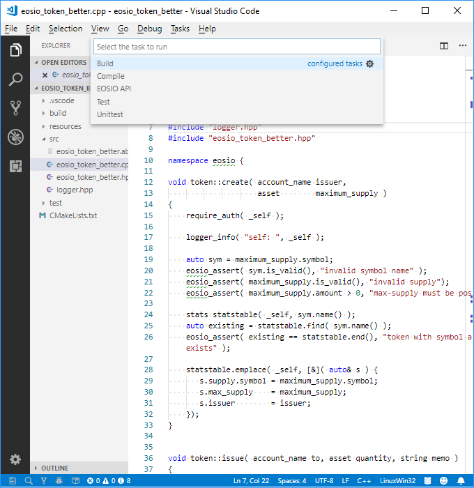
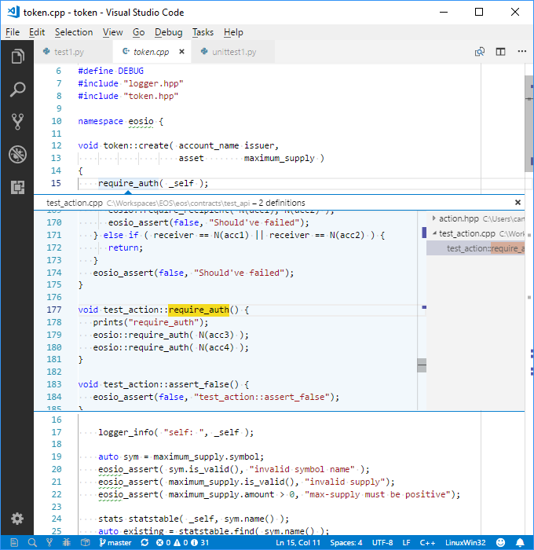

# Visual Studio Code IDE for EOSIO smart contracts

```md
To us, the EOSFactory is going to be an Integrated Development Environment for
the EOSIO smart contract.

The 'Visual Studio Code' is the base upon which we develop the EOSFactory.
Although you can use the Factory with a plain bash terminal, we recommend using 
the VScode: it can add new dimensions to your experience with the Factory. 

Let us assume that you have the VScode installed.
```

## Smart contract templates

<pre>
The Factory provides smart contract templates that you could use as a start 
points to development of your own code. For example, you can launch a smart 
contract named 'eosio_token_better':

* starting with the original EOSIO code of the 'eosio.token', 
* with its root at your workspace directory, for example, 
    '/mnt/c/Workspaces/EOS/contracts'.

If you omit the workspace directory argument, it will be used one set with 
the installation of the Factory. See <a href="configuration.html">cases/configuration</a>
to learn how to prevail the installation settings.

Use a bash terminal, it can be one belonging to an instance of the VScode: 
</pre>

```md
$ $eosf template create eosio_token_better eosio.token\
    --workspace /mnt/c/Workspaces/EOS/contracts --vsc
```

```md
We hope that you see an instance of the VScode window, now.
```

## IDE workspace

```md
If you miss, in the workspace, anything that you need for your work, we 
will try to add it in the next editions. Now, you can see the following items:

* 'src' directory, the cpp and hpp files are there.
* 'test' directory, test scripts are there.
* 'resources' directory, everything that does not fit to the previous two
    places goes there. It may contain the Ricardian contract files.
* '.vscode' directory that contains intellisense definitions, task 
    definitions, etc.
* 'CMakeLists.txt' file, CMake definitions.

Also, you can see the 'Tasks' dialog window:

* 'Build' results in building the contract; resulting 'ABI' and 'WAST'
    files go to the 'build' directory.
* 'Compile' results in compilation of the contract, without building
    (neither 'ABI' nor 'WAST' are produced), but code errors, if any,
    are listed.
* 'EOSIO API' results in opening (in the default browser) of the EOSIO
    manual.
* 'Test' - executes the 'test1`.py' script.
* 'Unittest' - executes the 'unittest1`.py' script.

Note that you can edit the literals. For example, if you change the test
name 'test1', you have to update both 'CMakeLists.txt' and 
'.vscode/tasks.json' files.
```



## Working on the code

```md
The VScode provides the C/CPP intelisense and easy access to the context. 
Especially, you can inspect any context code. The list of services is:

* Go to Definition.
* Pick Definition.
* Go to Declaration.
* Pick Declaration.

In the image below, you cen see a result of the 'Pick Definition' service. 
```



## Developing the code of the contract

```md
The sophisticated C/CPP development environment is now at your disposal, helping
to avoid mistakes, but the C/CPP to WASM cross-compiler can do more. Use the 
'Compile' task. In the image below, see an exemplary result.

There you can see a missing semicolon in the editor pane. (The shading is not
automatic.) Also, you can see the error message in the task panel. (Again, the 
shading is not automatic.) 
```


## Building the contract

```md
You can build the contract in two ways:

* Using the task 'Build'.
* Using the CMake.

The image below shows the CMake way. The result of the build process goes to
the 'build' directory.

You can do the same with any bash terminal, as well:
```
```md
$ cd build
$ CMake ..
$ make

```


## Running tests

```md
You can run tests in two ways:

* Using task 'Test' (or 'Unittest')
* Using the 'ctest'

The images below show the CMake way.

You can do the same with any bash terminal, as well:
```
```md
$ cd test
$ python3 test1.py
$ python3 unittest1.py
```


