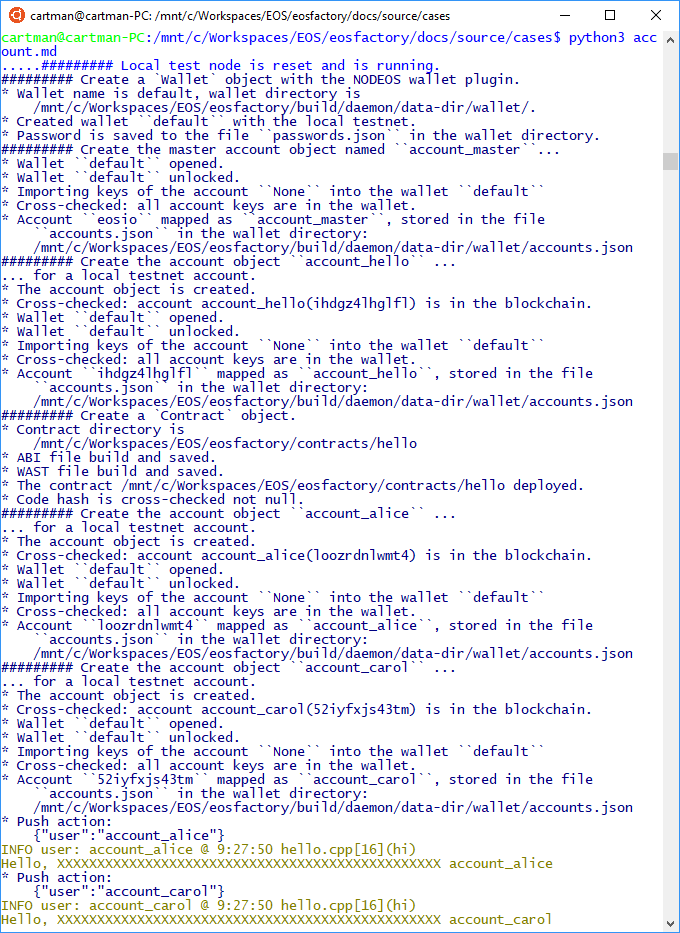

"""
# Account object

<pre><normal>
This file can be executed as a python script: 'python3 account.md'.

The set-up statements are explained at <a href="setup.html">cases/setup</a>.
</pre></normal>

## Set-up

<pre><normal>
"""
import setup
import eosf
from eosf_wallet import Wallet
from eosf_account import account_create, account_master_create
from eosf_contract import Contract

eosf.set_throw_error(True)
eosf.reset([eosf.Verbosity.TRACE])
"""
</pre></normal>

### Exactly one 'Wallet' object has to exist in the namespace

<pre><normal>
"""
wallet = Wallet()   
account_master_create("account_master")
eosf.set_throw_error(False)
"""
</pre></normal>

## Case

<pre><normal>
The 'EOSFactory' wraps EOSIO accounts with objects. Accounts can hold smart
contracts. 

Create an account objects: 'account_hello'. Add a contract of the class
'hello' to it. The code for the 'hello' class comes with the EOSIO 
repository.

Add two other account objects and execute the action of the account on them.
</pre></normal>

### The 'account_create' factory function

<pre><normal>
"""
account_create("account_hello", account_master)
"""
</pre></normal>
<pre><normal>
The first argument is the name of the account object to be created, the second
one points to the account master, authorizing the creation.

Only the first argument is necessary, however there is several default 
arguments that sometimes have to be adjusted.
</pre></normal>
<pre><normal>
The 'account_create' does many tasks:

    * Check whether a 'Wallet' object exist in the namespace.
    * Check whether its first argument is not the same as the name of any other
        account objects in the Factory's statistics. If it is so, a correction
        action is proposed - see the 'account_name_conflict.md' case.
    * Create a global object named as the first argument, representing 
        a physical account of a random name (however, the name cen be fixed).
    * Open the wallet, unlock it, put the physical account into it.
    * Update the statistics of the accounts.

All the actions are logged to the terminal, if the verbosity is set default. 
</pre></normal>

### Methods of an account objects

<pre><normal>
Any (almost) account object can:

    * Load a smart contract.
    * Push an action on its contract.
    * Show its entry (a table) in the blockchain database,

</pre></normal>

### Create a Contract object

<pre><normal>
Now, you have to create a smart contract object instance, appending it to the 
account 'account_hello'. The 'Contract' class is presented at
<a href="contract.html">cases/contract</a>.
</pre></normal>
<pre><normal>
"""
contract_hello = Contract(account_hello, "hello")
contract_hello.build()
contract_hello.deploy()
"""
</pre></normal>
<pre><normal>
The second argument of the creator of the 'Contract' class identifies the 
code source. The EOSFactort tries to be smart and searches the repository of the 
Factory. If it fails, put the right path there, 
'/mnt/c/Workspaces/EOS/eosfactory/contracts/hello/',
for example.

As the deployment succeeded, the contract can be executed.
</pre></normal>

### Try the contract

<pre><normal>
For tests, create two contracts 'account_alice' and 'account_carol'...
</pre></normal>

<pre><normal>
"""
account_create("account_alice", account_master)
account_create("account_carol", account_master)
"""
</pre></normal>
<pre><normal>
... and execute the action of the contract 'hello':
</pre></normal>
<pre><normal>
"""
account_hello.push_action(
    "hi", '{"user":"' + str(account_alice) + '"}', account_alice)

account_hello.push_action(
    "hi", '{"user":"' + str(account_carol) + '"}', account_carol)
"""
</pre></normal>
<pre><normal>
Besides the usual 'Hello' message, you can see the result of a logging 
facility, starting with 'INFO'.
</pre></normal>

### Test run

<pre><normal>
In an linux bash, change directory to where this file exists, it is the 
directory 'docs/source/cases' in the repository, and enter the following 
command:
</pre></normal>
<pre><normal>
$ python3 account.md
</pre></normal>
<pre><normal>
We hope that you get something similar to this shown in the image below.
</pre></normal>

"""