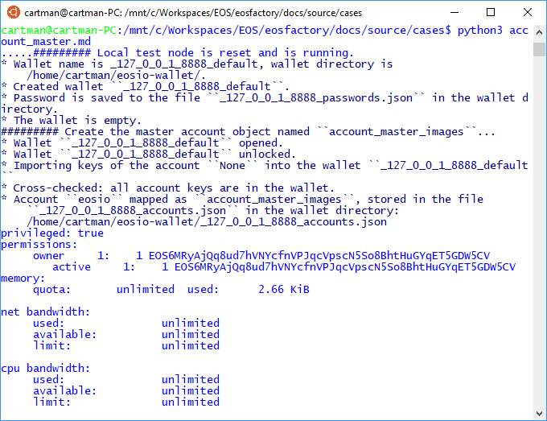
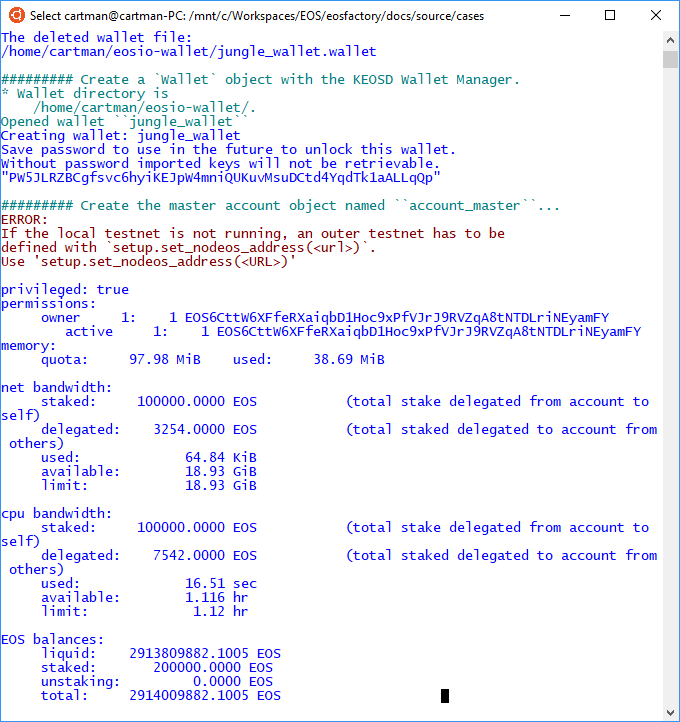

"""
# Account master object

```md
This file can be executed as a python script: 'python3 account_master_images.md'.
```

## Set-up

<pre>
The set-up statements are explained at <a href="setup.html">cases/setup</a>.
</pre>
```md
"""
import os
import setup
import eosf
import eosf_account
from eosf_wallet import Wallet
from eosf_account import account_create, account_master_create
from eosf_contract import Contract

remote_testnet = "88.99.97.30:38888"
_ = eosf.Logger()
"""
```

```md
The following account exists in the blockchain of the testnode. It is used, in
this article, for testing. It is referred to as the 'testing account'.
```

```md
Account Name: dgxo1uyhoytn
Owner Public Key: EOS8AipFftYjovw8xpuqCxsjid57XqNstDyeTVmLtfFYNmFrgY959
Active Public Key: EOS6HDfGKbR79Gcs74LcQfvL6x8eVhZNXMGZ48Ti7u84nDnyq87rv

Owner Private Key: 5JE9XSurh4Bmdw8Ynz72Eh6ZCKrxf63SmQWKrYJSXf1dEnoiKFY
Active Private Key: 5JgLo7jZhmY4huDNXwExmaWQJqyS1hGZrnSjECcpWwGU25Ym8tA 
```


## Case

<pre>
The EOSFactory wraps EOSIO accounts with objects. The 'account_create` 
factory function produces account objects, it is explained in the article 
<a href="account.html">cases/account</a>.

EOSIO needs that any action changing the blockchain, especially account creation 
is authorized. Usually, an existing account provides the authorization, and
therefore the 'account_create` factory take this account as its second argument.

But at the very beginning there is no account, and the very first one has to be
produced. The 'account_master_create' factory function can do this.

The 'account_master_create' function takes the 
name of the account object to be created, as its first obligatory argument.

There are three cases where the 'account_master_create' factory can do. We will
show them. 
</pre>

### Local testnet case

```md
"""
eosf.reset([eosf.Verbosity.TRACE])
wallet = Wallet()
account_master_create("account_master_images")
account_master_images.info()
eosf.stop([eosf.Verbosity.TRACE])
"""
```

```md
The result of the script is the account object 'account_master_images' in the global
namespace.

The object wraps the 'eosio` account. It is a special one in the sense that it 
does not have all the functionality of plain orders.
```

```md
We hope that you get something similar to this one shown in the image below.
```


### Remote testnet registration

```md
This case is shown at <a href="setup.html">cases/registering_to_testnode</a>. There the account object is 
produced by manual interaction with the registration form of a testnet. There 
the resulting account object is fully functional.
```

### Adding a physical account

```md
If the user posses an account, that is, knows the account name and private keys,
they can add it to the Factory.

In order to show a clean and reproducible example, we will delete a testing 
wallet in the KEOSD-managed wallet directory, and recreate it.
```

```md
"""
eosf.use_keosd(True)    # to determine the directory of the wallet
eosf.kill_keosd()       # otherwise, the manager protects the wallet file

wallet_name = "jungle_wallet"
try:
    wallet_file = eosf.wallet_dir() + wallet_name + ".wallet"
    os.remove(wallet_file)
    print("The deleted wallet file:\n{}\n".format(wallet_file))
except Exception as e:
    print("Cannot delete the wallet file:\n{}\n".format(str(e)))
"""
```

```md
"""
eosf_account.restart()    # reset the Factory
eosf.use_keosd(True)
setup.set_nodeos_address(remote_testnet)

wallet = Wallet(wallet_name)
account_master_create(
    "account_master_images",
    "dgxo1uyhoytn",
    "5JE9XSurh4Bmdw8Ynz72Eh6ZCKrxf63SmQWKrYJSXf1dEnoiKFY",
    "5JgLo7jZhmY4huDNXwExmaWQJqyS1hGZrnSjECcpWwGU25Ym8tA"
    )
account_master_images.info()
"""
```

```md
We hope that you get something similar to this one shown in the image below.
```


"""