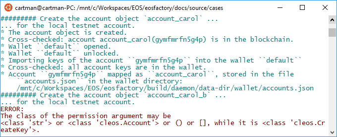

"""
# Arguments

```md
This file can be executed as a python script: 'python3 contract.md'.
```

```md
Arguments of the EOSFactory statements are polymorphic. For example, a 
'permission` argument can have the following forms:

    * <account object>
    * <the name of an account object>
    * (<account object>, <permission level>), that is a tuple of two items
    * <the name of an account object>@<permission level>
    * [(<account object>, <permission level>), ...] that is a list of tuples
    * combinations of the above

The polymorphism results from the origin of the EOSFactory, started as a wrapper 
for the 'CLEOS' commands. We have not decided yet, whether it is a value: a 
disadvantage is that type errors are not detected by the compiler. An advantage 
may be that users like it.
```

## Setup

<pre>
The set-up statements are explained at <a href="setup.html">cases/setup</a>.

Local test node reset, wallet started, master account object created.
</pre>

```md
"""
import setup
import cleos
import eosf

from eosf_wallet import Wallet
from eosf_account import account_create, account_master_create
from eosf_contract import Contract
_ = eosf.Logger()

eosf.use_keosd(False)
eosf.reset([eosf.Verbosity.TRACE]) 
wallet = Wallet()
account_master_create("account_master")
"""
```
## Case

### Account arguments

```md
Accounts are represented either as blockchain names or as account objects. In
the following test, the 'account_master' object enters, at first, as itself ...
```
```md
"""
account_create("account_alice", account_master)
"""
```
```md
... next, the 'account_master' is represented as a string, 'eosio` in this case:
```
```md
"""
account_create("account_bob", str(account_master))
"""
```
```md
If an account argument is neither an account object nor a string, an error 
message is printed, or an error exception is thrown. For example, let the 
account argument be of the 'cleos.CreateKey' type:
```
```md
"""
account_create("account_jimmy", cleos.CreateKey("xxx", is_verbose=0))
"""
```


### Permission arguments

```md
In the simpest form, permissions are like accounts: account objects or account 
names.

If an account name is used, it can be decorated with a permission level: 
'eosio@permission', for example.

Using the object oriented style, a permission may be a tuple enclosing an 
account object and 
```

```md
"""
from cleos import Permission 

account_create(
    "account_carol", account_master, 
    permission=[
        (account_master, Permission.OWNER), 
        (account_master, Permission.ACTIVE)])
"""
```md
equivalent forms:
permission=[ ("eosio", "owner"), ("eosio", "active")])
    or
permission=[ "eosio@owner", "eosio@active"])

If a permission argument type is not supported, an error message is printed, or 
an error exception is thrown. For example, let the account argument be of the 
'cleos.CreateKey' type:
```
```md
"""
account_create(
    "account_carol_b", account_master, 
    permission=cleos.CreateKey("xxx", is_verbose=0))
"""
```


### Data arguments

```md
```
```md

```
"""