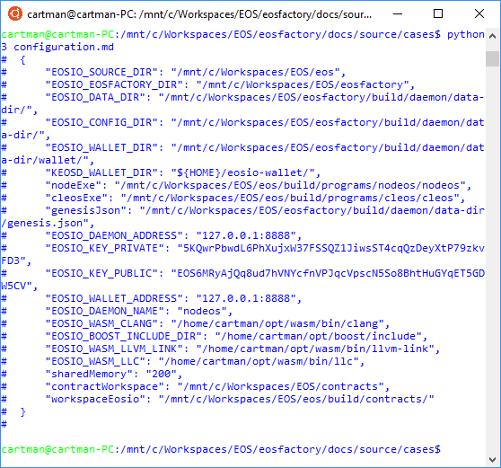

"""
# EOSFactory configuration

<normal><pre>
This file can be executed as a python script: 'python3 configuration.md'.

The set-up statements are explained at <a href="setup.html">cases/setup</a>.
</pre></normal>

## Inspect the configuration

<normal><pre>
"""
import teos

ok = teos.GetConfig()

"""
</pre></normal>
<normal><pre>
Note that the same result is available with this bash command:
</pre></normal>
<normal><pre>
$eosf get config
</pre></normal>

## Override the installed configuration

<normal><pre>
There is the 'config.json' file in the 'teos' folder of the repository. 
The entries there prevail the default settings.
</pre></normal>

## Test run

<normal><pre>
In an linux bash, change directory to where this file exists, it is the 
directory 'docs/source/cases' in the repository, and enter the following 
command:
</pre></normal>
<normal><pre>
$ python3 configuration.md
</pre></normal>
<normal><pre>
or
</pre></normal>
<normal><pre>
$ $eosf get config
</pre></normal>
<normal><pre>
We hope that you get something similar to this shown in the image below.
You can change or add something in the configuration file 'teos/config.json' 
and see the result.
</pre></normal>

    
"""