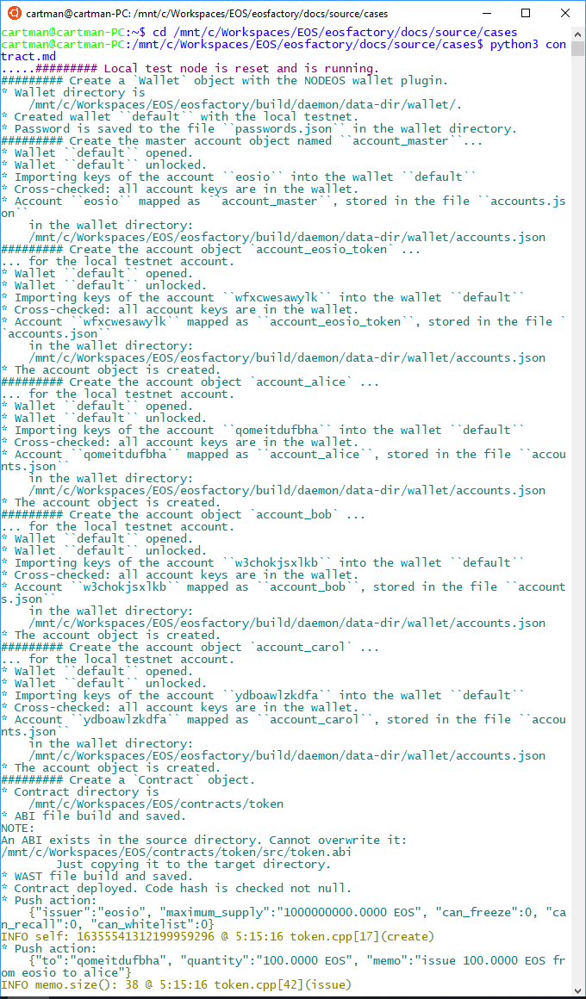

"""
# Contract object

```md
This file can be executed as a python script: 'python3 contract.md'.
```

## Set-up

<pre>
The set-up statements are explained at <a href="setup.html">cases/setup</a>.
</pre>

```md
"""
import setup
import eosf
from eosf_wallet import Wallet
from eosf_account import account_create, account_master_create
from eosf_contract import Contract

eosf.set_throw_error(True)
eosf.reset([eosf.Verbosity.TRACE])
"""
```

### Exactly one 'Wallet' object has to exist in the namespace

```md
"""
wallet = Wallet()   
account_master_create("account_master")
eosf.set_throw_error(False)
"""
```

## Case

<pre>
None 'Contract' object can exist without an account object that keeps this
contract. The account object is presented at <a href="account.html">cases/account</a>.

Create an account objects: 'account_eosio_token'. Provide it with a contract 
of the class 'eosio.token'. The code for the 'eosio.token' class comes with 
the EOSIO repository, and it is copied, slightly modified to the Factory's. 
We use the later copy.

Make three other account objects, and execute actions of the contract on them.
</pre>

### Accounts

```md
"""
account_create("account_eosio_token", account_master)
account_create("account_alice", account_master)
account_create("account_bob", account_master)
account_create("account_carol", account_master)
"""
```

### Create a Contract object

```md
Create an instance of the 'Contract' class, appending it to the account 
'account_eosio_token':
```
```md
"""
contract_eosio_token = Contract(account_eosio_token, "token")
"""
```
```md
The second argument of the creator of the 'Contract' class identifies the 
code source. The Factory tries to be smart, and searches the repository of the 
Factory. If it fails, put the right path there, 
'/mnt/c/Workspaces/EOS/eosfactory/contracts/eosio.token/',
for example.

Note that the 'Contract' creator takes several default arguments that 
sometimes have to be adjusted.
```

### Methods of a contract objects

```md
Any 'Contract' object can:

* Build itself.
    * Build abi alone.
    * Build wast alone.
* Deploy itself.
* Push an action.
* Show an action pushing it without broadcasting.
* Show entry (a table) in the blockchain database of its account.
```

### Deploy and build the contract

```md
"""
contract_eosio_token.build()
contract_eosio_token.deploy()
"""
```

### Try the contract

```md
Execute actions of the contract:
```
```md
"""
contract_eosio_token.push_action(
    "create", 
    '{"issuer":"' 
        + str(account_master) 
        + '", "maximum_supply":"1000000000.0000 EOS", \
        "can_freeze":0, "can_recall":0, "can_whitelist":0}')

contract_eosio_token.push_action(
    "issue",
    '{"to":"' + str(account_alice)
        + '", "quantity":"100.0000 EOS", '
        + '"memo":"issue 100.0000 EOS from eosio to alice"}',
    permission=account_master)

contract_eosio_token.push_action(
    "transfer",
    '{"from":"' + str(account_alice)
        + '", "to":"' + str(account_carol)
        + '", "quantity":"25.0000 EOS", '
        + '"memo":"transfer 25.0000 EOS from alice to carol"}',
    permission=account_alice)

contract_eosio_token.push_action(
    "transfer",
    '{"from":"' + str(account_carol)
        + '", "to":"' + str(account_bob)
        + '", "quantity":"11.0000 EOS", '
        + '"memo":"transfer 11.0000 EOS from carol to bob"}',
    permission=account_carol)

contract_eosio_token.push_action(
    "transfer",
    '{"from":"' + str(account_carol)
        + '", "to":"' + str(account_bob)
        + '", "quantity":"2.0000 EOS", '
        + '"memo":"transfer 2.0000 EOS from carol to bob"}',
    permission=account_carol)

contract_eosio_token.push_action(
    "transfer",
    '{"from":"' + str(account_bob)
        + '", "to":"' + str(account_alice)
        + '", "quantity":"2.0000 EOS", '
        + '"memo":"transfer 2.0000 EOS from bob to alice"}',
    permission=account_bob)                
"""
```
```md
Inspect the database of the blockchain:
```
```md
"""
table_alice = account_eosio_token.table("accounts", account_alice)
table_bob = account_eosio_token.table("accounts", account_bob)
table_carol = account_eosio_token.table("accounts", account_carol)
"""
```

```md
You can see the result of a logging facility, printed in yellow, starting with 
'INFO'.
```

### Test run

```md
In an linux bash, change directory to where this file exists, it is the 
directory 'docs/source/cases' in the repository, and enter the following 
command:
```
```md
$ python3 contract.md
```
```md
We hope that you get something similar to this one shown in the image below.
```


"""