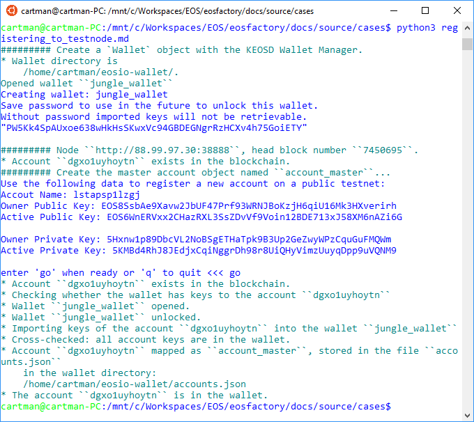

"""
# Registering to a remote testnet

```md
This file can be executed as a python script: ``python3 
registering_to_testnode.md``.
```

## Set-up

```md
The following account exists in the blockchain of the testnode. It is used, in
this article, for testing. It is reffered to as the ``testing account``.
```

```md
Accout Name: dgxo1uyhoytn
Owner Public Key: EOS8AipFftYjovw8xpuqCxsjid57XqNstDyeTVmLtfFYNmFrgY959
Active Public Key: EOS6HDfGKbR79Gcs74LcQfvL6x8eVhZNXMGZ48Ti7u84nDnyq87rv

Owner Private Key: 5JE9XSurh4Bmdw8Ynz72Eh6ZCKrxf63SmQWKrYJSXf1dEnoiKFY
Active Private Key: 5JgLo7jZhmY4huDNXwExmaWQJqyS1hGZrnSjECcpWwGU25Ym8tA 
```

```md
"""
import os
import unittest
import setup
import eosf
import eosf_account
from eosf_wallet import Wallet
from eosf_account import account_master_create

eosf.set_verbosity([eosf.Verbosity.EOSF, eosf.Verbosity.OUT, \
    eosf.Verbosity.DEBUG])
eosf.set_throw_error(False)

cryptolions = "88.99.97.30:38888"
_ = eosf.Logger()

"""
```
#### Set a remote testnode
```md
"""
eosf.use_keosd(True)        # use KEOSD Wallet Manager
setup.set_nodeos_address(cryptolions)
eosf.kill_keosd()           # to have a clean start
"""
```
#### Clean the 'jungle wallet'
```md
Delete existing, if any, wallet named ``jungle_wallet``, and create a new, 
fresh one:
```
```md
"""
wallet_name = "jungle_wallet"
try:
    os.remove(eosf.wallet_dir() + wallet_name + ".wallet")
except:
    pass

wallet = Wallet(wallet_name)

eosf.set_is_testing_errors(False)
eosf.set_throw_error(True)

"""
```
#### Is the testnode ON?

```md
Throw an exception if the testnode is off:
```

```md
"""
eosf.info()
"""
```
#### Introduce a test trick

```md
Use an active account, named ``account_master_test`` to simulate the 
registration procedure: this account substitutes one that would be
physically registered.

```

```md
"""
eosf_account.account_master_test = eosf_account.GetAccount(
    "account_master_test",
    "dgxo1uyhoytn", 
    "5JE9XSurh4Bmdw8Ynz72Eh6ZCKrxf63SmQWKrYJSXf1dEnoiKFY",
    "5JgLo7jZhmY4huDNXwExmaWQJqyS1hGZrnSjECcpWwGU25Ym8tA"
)
eosf_account.account_master_test.ERROR()
"""
```
#### End the set-up part
```md
"""
eosf.set_throw_error(False)         # on error, do not throw exception
eosf.set_is_testing_errors()        # make error messages less alarming
"""
```

## Case

```md
In subsequent tests, you may have to change the account object name, here 
``account_master``, or to resolve name conflicts, if you are prompted.
```
#### Register to the testnode
```md
"""
account_master_create("account_master")
"""
```
#### Test run
```md
In an linux bash, change directory to where this file exists, it is the 
directory ``docs/source/cases`` in the repository, and enter the following 
command:
```
```md
$ python3 registering_to_testnode.md
```
```md
We hope that you get anything similar to this shown in the image below.
```

    
"""