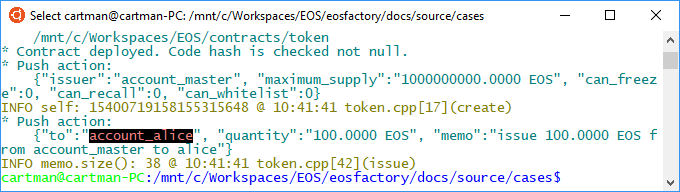

"""
# Symbolic names
<pre>
This file can be executed as a python script: 'python3 wallet.md'.

The set-up statements are explained at <a href="setup.html">cases/setup</a>.
</pre>

## Set-up

<pre>
"""
import setup
import eosf
import time
import eosf_account

from eosf_wallet import Wallet
from eosf_account import account_create, account_master_create
from eosf_contract import Contract

eosf.set_verbosity([eosf.Verbosity.EOSF, eosf.Verbosity.OUT, \
    eosf.Verbosity.DEBUG])
eosf.set_throw_error(False)
"""
</pre>

## Case
<pre>
The EOSIO accounts are indexed by their names, therefore the names have to be 
unique in the blockchain have the specific format. Then it is not possible to
grasp any association betwin the account name and its function specified in the
Ricardian Contract. 

For example, if there is, in the Contract, a notion of an account keeping a 
'school fund 2018'. We can try the name 'school.fund1'. It is not only very far 
to a satisfactory name, but it can be already taken.

A natural solution to the problem is to have aliasses to the physical names. 
Perhaps, the structure of the native EOSIO account should have a field for that, 
it is not sow, now, therefore the EOSFactory uses its own system.

In EOSFactory, the physical accounts are wrapped with account object produced 
with the 'account_create' factory function. (see <a href="account.html">cases/account</a>). The physical name 
of an EOSIO account is then aliased with the name of the account object.

In a script, the aliasing is made with the following statement:

account_create("school_fund_2018", ...)

resulting with the account object named 'school_fund_2018' representing the 
physical account in the blockchain, featuring a random, jet defined name. 
Moreover, the physical account has its keys imported to the wallet, already.

</pre>

### Physical name to aliass translation

<pre>

All the responces from the blockchain refer to the physical names of the 
accounts involved. With the aliass mapping, EOSFactory can translate the to the
aliasses.

The current case demonstrates this facility.

</pre>

#### Translation is off

<pre>
"""
eosf_account.restart()
eosf_account.set_is_translating(False)

eosf.use_keosd(False)
eosf.reset([eosf.Verbosity.TRACE]) 
wallet = Wallet()
account_master_create("account_master")
eosf.set_throw_error(False)
eosf.set_is_testing_errors()

account_create("account_alice", account_master)
account_create("account_bob", account_master)
account_create("account_carol", account_master)
account_create("account_eosio_token", account_master)
contract_eosio_token = Contract(account_eosio_token, "token")
deploy = contract_eosio_token.deploy()

time.sleep(1)

account_eosio_token.push_action(
    "create", 
    '{"issuer":"' 
        + str(account_master) 
        + '", "maximum_supply":"1000000000.0000 EOS", \
        "can_freeze":0, "can_recall":0, "can_whitelist":0}')

account_eosio_token.push_action(
    "issue",
    '{"to":"' + str(account_alice)
        + '", "quantity":"100.0000 EOS", '
        + '"memo":"issue 100.0000 EOS from eosio to alice"}',
    permission=account_master)
"""
</pre>

#### Translation is on

<pre>
"""
eosf_account.restart()
eosf_account.set_is_translating(True)

eosf.use_keosd(False)
eosf.reset([eosf.Verbosity.TRACE]) 
wallet = Wallet()
account_master_create("account_master")
eosf.set_throw_error(False)
eosf.set_is_testing_errors()

account_create("account_alice", account_master)
account_create("account_bob", account_master)
account_create("account_carol", account_master)
account_create("account_eosio_token", account_master)
contract_eosio_token = Contract(account_eosio_token, "token")
deploy = contract_eosio_token.deploy()

time.sleep(1)

account_eosio_token.push_action(
    "create", 
    '{"issuer":"' 
        + str(account_master) 
        + '", "maximum_supply":"1000000000.0000 EOS", \
        "can_freeze":0, "can_recall":0, "can_whitelist":0}')

account_eosio_token.push_action(
    "issue",
    '{"to":"' + str(account_alice)
        + '", "quantity":"100.0000 EOS", '
        + '"memo":"issue 100.0000 EOS from eosio to alice"}',
    permission=account_master)
"""
</pre>

