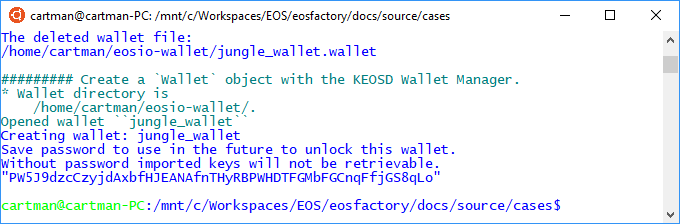

"""
# Wallet object

<pre>
This file can be executed as a python script: 'python3 wallet.md'.

The set-up statements are explained at <a href="setup.html">cases/setup</a>.
</pre>

## Set-up

<pre>
"""
import os
import setup
import eosf
import eosf_account
from eosf_wallet import Wallet
from eosf_account import account_create, account_master_create
from eosf_contract import Contract

eosf.set_throw_error(False)
"""
</pre>

## Case

<pre>
The 'Wallet` class wraps EOSIO wallets. The 'Wallet' object keep account 
objects, presented at <a href="account.html">cases/account</a>.

The EOSIO physical wallet, if used with the Factory, can be managed either 
with the 'KEOSD Wallet Manager' or with the 'NODEOS' wallet plugin. The status 
is controlled with the 'use_keosd' statement (default is 'False'):
</pre>

<pre>
eosf.use_keosd(True)
</pre>

<pre>
The 'NODEOS' alternative apply if the local node is running.

It can be exactly one 'Wallet' object in the namespace. After the 'Wallet' 
singleton is created, it remains transparent to the script: usually, there 
is no need to refer to it.

If the 'Wallet' object is of the local testnet, its password is kept between 
sessions, and used automatically.

Let us consider two cases: 'NODEOS` and 'KEOSD' subsequently.
</pre>

### NODEOS managed wallet

<pre>
"""
eosf.use_keosd(False)
eosf.reset([eosf.Verbosity.TRACE])          # reset the local testnet
wallet = Wallet()
wallet.keys()
account_master_create("account_master")     # account object is put to wallet
wallet.keys()
wallet.lock_all()

eosf.stop()                                 # stop the local testnet
"""
</pre>

<pre>
What has happened?

* The local node has restarted, that is the local wallet file was deleted.
* The wallet object has been created.
* Its password has been stored to a file.
* An account object named 'account_master' has been created and placed in
    the wallet.

If we close the session, then open it again, and recreate the wallet, we can
expect that it opens without calling for password, having the same keys.
</pre>

<pre>
"""
eosf_account.restart()                      # reset the Factory
eosf.run([eosf.Verbosity.TRACE])    # restart the local testnet
wallet = Wallet()
wallet.keys()   
eosf.stop()                         # stop the local testnet
"""
</pre>

### KEOSD managed wallet

<pre>
For the sake of this tutorial, we dare to treat a system wallet so rudely:
we delete it.
</pre>

<pre>
"""
eosf.use_keosd(True)    # to determine the directory of the wallet
eosf.kill_keosd()       # otherwise, the manager protects the wallet file

wallet_name = "jungle_wallet"
try:
    wallet_file = eosf.wallet_dir() + wallet_name + ".wallet"
    os.remove(wallet_file)
    print("The deleted wallet file:\n{}\n".format(wallet_file))
except Exception as e:
    print("Cannot delete the wallet file:\n{}\n".format(str(e)))
"""
</pre>

<pre>
Create a 'KEOSD' wallet named 'wallet_name':
</pre>

<pre>
"""
eosf_account.restart()                      # reset the Factory
eosf.use_keosd(True)

wallet = Wallet(wallet_name)
"""
</pre>

### Methods of the 'Wallet' class

<pre>
We plan the Factory so that the singular wallet object is never referred to, in
usual scripts. However, the 'Wallet` class has several methods that are used
internally. Some of them are obvious:

* Open wallet.
* Unlock wallet.
* Keys in all open wallets.
* etc.
</pre>

"""

