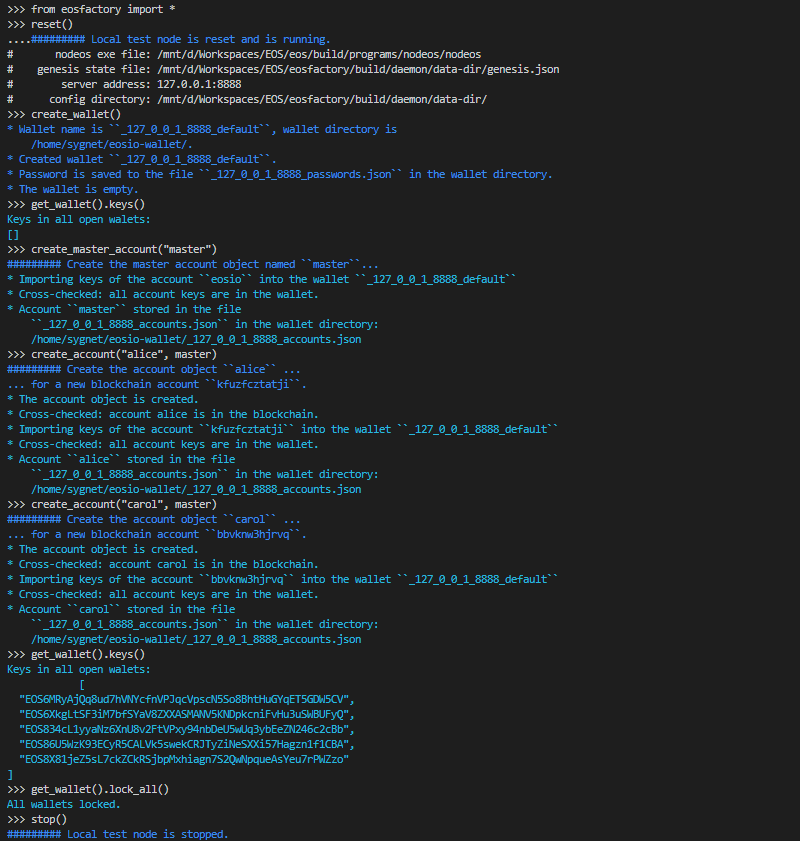
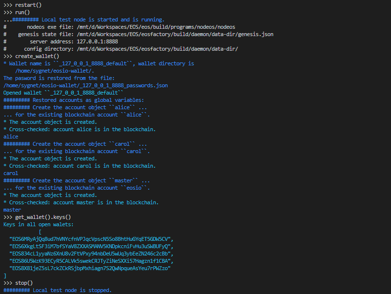
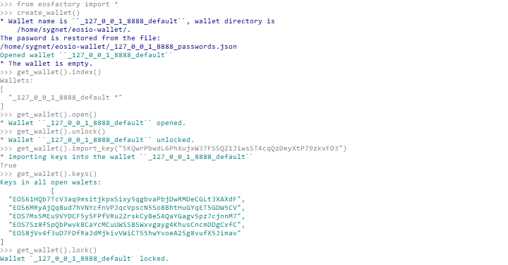
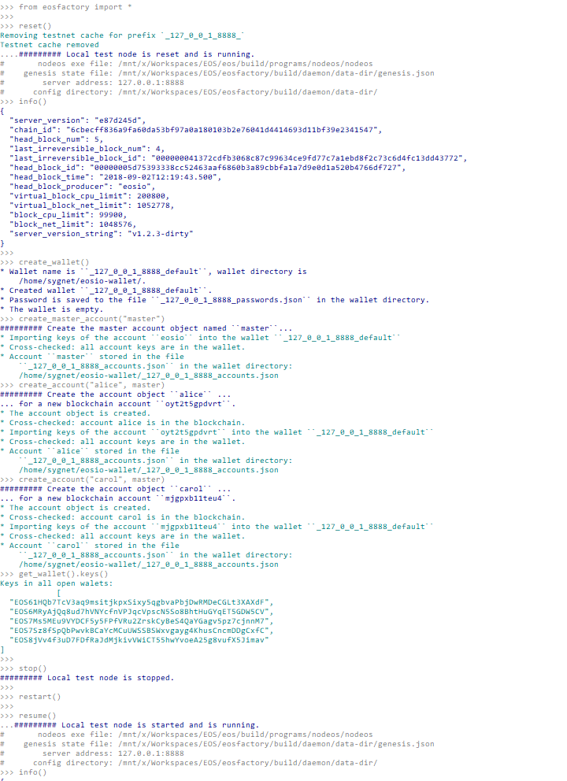

# The Wallet Class

This case demonstrates how the `Wallet` class works.

## Set-up

Open a bash terminal and run Python CLI:

```
$ python3
```

Once in the Python shell, import the *EOSFactory* library:

```
from eosfactory import *
```

## Context

The `Wallet` class wraps an *EOSIO* wallet. An instance of the class, i.e. a `Wallet` object keeps track of `Account` objects.

The `Wallet` class is a singleton, so there needs to be exactly one `Wallet` object in the namespace. After the `Wallet` is created with the `create_wallet()` command, it remains transparent to the script, yet usually there is no need to access it directly.

Although *EOSFactory* manages only one `Wallet` object at a time, it produces numerous wallet files in the wallet directory, i.e. in the location where the `keosd` wallet manager stores its wallets.

The wallet files are marked with prefixes, which are either encoding the URL of the active testnet (i.e. the one which is active the `create_wallet()` command is executed) or arbitrary (i.e. defined *ad hoc* by a specific unit test).

There is an important distinction regarding wallet prefixes:

* URL prefixes are used in context of various testnets. They allow *EOSFactory* to keep state between different Python sessions.
* Arbitrary prefixes mark wallets associated with specific unit tests. They allow *EOSFactory* to keep state between different unit tests performed on the same testnet.
* Empty prefix (not implemented yet) are reserved for wallets to be used with the mainnet.

## Case

#### Create a new wallet

First, lets's start a local testnet:


```
reset()
info()
```

Next, create a wallet, then create a couple of accounts and finally let the `Wallet` object list the private keys associated with those accounts:
```
create_wallet()
create_master_account("master")
create_account("alice", master)
create_account("carol", master)
get_wallet().keys()
```

Here is the expected outcome:



What has happened?

* The wallet object is created, with its password is stored locally in a file.
* An account object named `master` is created and its keys are stored in the wallet.
* Similarly, account objects named `alice` and `carol` are created and their keys are stored in the wallet.

You can now stop the local testnet:

```
stop()
```

And exit Python CLI:

```
exit()
```

#### Resume the testnet

Let's now create a new Python session:

```
$ python3
```

```
from eosfactory import *
```

Resume the testnet:

```
resume()
info()
```

When you run the `create_wallet()` command, *EOSFactory* will recreate the existing wallet, including the private keys we created in the previous session:

```
create_wallet()
get_wallet().keys()
```

Here is the expected outcome:



You can now stop the local testnet:

```
stop()
```

And exit Python CLI:

```
exit()
```

#### Reset the testnet

Let's now create a new Python session:

```
$ python3
```

```
from eosfactory import *
```

And this time we reset the testnet:

```
reset()
info()
```

When you run the `create_wallet()` command, *EOSFactory* will lose track of the private keys, as the wallet is created from scratch. This is because the local testnet was reset, not resumed.

```
create_wallet()
get_wallet().keys()
```
You should get output similar to this:


You can now stop the local testnet:

```
stop()
```

#### Methods of the Wallet class

As we mentioned before, when working with unit tests you should never need to access the `Wallet` object directedly. 

However, if you do, here is a list of methods available in the `Wallet` class: 

```
get_wallet().index()
get_wallet().open()
get_wallet().unlock()
get_wallet().import_key("5KQwrPbwdL6PhXujxW37FSSQZ1JiwsST4cqQzDeyXtP79zkvFD3")
get_wallet().keys()
get_wallet().lock()
```

You should get output similar to this:



You can now exit Python CLI:

```
exit()
```

## Test Run

The examples presented in this document can be executed as a Python script:
```
python3 docs/sphinx/source/cases/03_wallet/case.py
```
You should get output similar to this:

