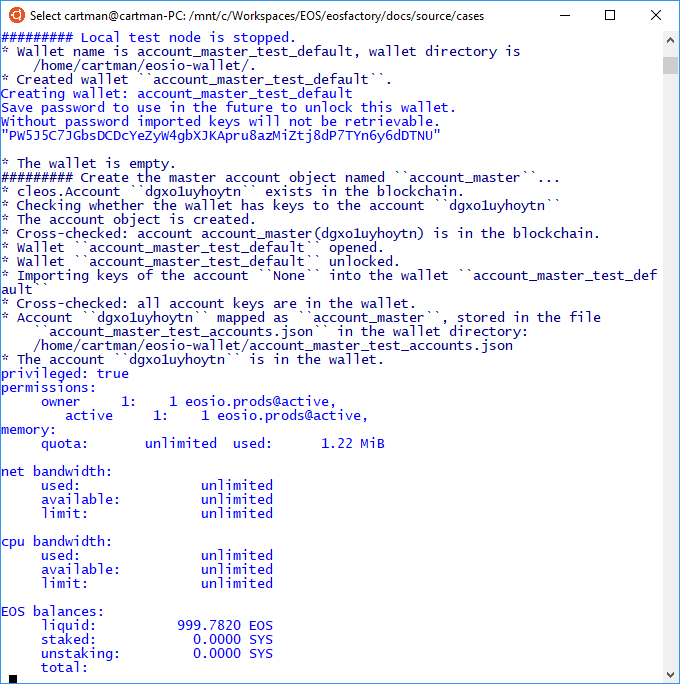

'''
# Account master object

This file can be executed as a python script: 'python3 account_master.md'.

## Set-up

The set-up statements are explained at <a href="html">cases/setup</a>.

```md
'''
from  eosfactory import *
Logger.verbosity = [Verbosity.INFO, Verbosity.OUT]
_ = Logger()
'''
```

```md
'''
import testnet_data
testnet = testnet_data.kylin
'''
```

## Case

The EOSFactory wraps EOSIO accounts with objects. The 'account_create` factory function produces account objects, it is explained in the article <a href="account.html">cases/account</a>.

EOSIO needs that any action changing the blockchain, especially account 
creation, is authorized by an existing account, therefore the 'account_create` 
factory takes this account as its second argument.

At the very beginning the very first one has to be produced. The 'account_master_create' factory function is to do this.

The function 'account_master_create' takes, as its first obligatory argument, the name of the account object to be created.

There are three cases where the 'account_master_create' factory can do. We will
show them. 

### Local testnet case

```md
'''
reset([Verbosity.INFO])
wallet = Wallet()
account_master_create("account_master_images")
account_master_images.info()
stop([Verbosity.INFO])
'''
```

The result of the script is the account object 'account_master_images' in the global namespace.

The object wraps the 'eosio` account as a special one in the sense that it 
does not have all the functionality of plain orders.

We expect that you get something similar to this one shown in the image below.


### Remote testnet registration

This case is shown at <a href="html">cases/registering_to_testnode</a>. 
There the account object is produced by manual interaction with the registration form of a testnet. There the resulting account object is fully functional.

### Adding a physical account

If the user posses an account, that is, knows the account name and private keys,
they can add it to the Factory. In this show, we use an real account represented with the `testnet` object. 


```md
'''
eosf_account.restart()    # reset the Factory
set_nodeos_address(testnet.url, "account_master_test")
'''
```
Delete files possibly created previously:
```md
'''
remove_files()
'''
```
First, the 'Wallet` singleton has to be created:
```md
'''
wallet = Wallet()
account_master_create(
    "account_master",
    testnet.account_name,
    testnet.owner_key,
    testnet.active_key
    )
account_master_images.info()
'''
```
Adding one orphan account programmatically is not practical, therefore we have a script that can help. For example:

```md
python3 add_account.py https://api.kylin-testnet.eospace.io \
account_master \
dgxo1uyhoytn \
5K4rezbmuoDUyBUntM3PqxwutPU3rYKrNzgF4f3djQDjfXF3Q67 \
5JCvLMJVR24WWvC6qD6VbLpdUMsjhiXmcrk4i7bdPfjDfNMNAeX
```


### Test run

If you execute this script with the command `python3 account_master.md`,
you may epect to get something similar to what we show shown in the image below.


'''