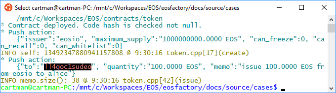

'''
# Symbolic names

This file can be executed as a python script: 'python3 symbolic_names.md'.

## Set-up

The set-up statements are explained at <a href="setup.html">cases/setup</a>.

```md
'''
from  eosfactory import *
'''
```

## Case

The EOSIO accounts are indexed by their names, therefore the names have to be 
unique in the blockchain, and to have the specific format. Then it is not 
possible to grasp any intuitive association between the account name and its 
role specified in the Ricardian Contract. 

For example, if there is in the Contract a notion of an account keeping a 
'school fund 2018', we can try the name 'school.fund1'. It is not only far to
a satisfactory name, but it can be taken already.

A natural solution to the problem is to have aliases to the physical names. 
Perhaps, the structure of the native EOSIO account should have a field and 
method for this, it is not so now, therefore the EOSFactory uses its own system.

With EOSFactory, the physical accounts are wrapped in objects produced with the
'create_account' factory function. (see <a href="account.html">cases/account</a>). The physical name 
of an EOSIO account is then aliased with the name of the corresponding account 
object.

In a script, the aliasing is made with a statement like the following one:

create_account("school_fund_2018", ...)

The result is a new object in the global namespace, named 'school_fund_2018', 
representing a physical account of a random name. Moreover, account's keys are 
automatically imported to the wallet.

Once established correspondence between physical accounts and their object 
representations is kept between sessions.

### Physical name translation

All the responses from the blockchain refer to the physical names of the 
accounts involved. With the alias mapping, EOSFactory can translate the to the
aliases.

The current case demonstrates this facility.

#### Translation is off

```md
'''
set_is_translating(False)

reset()
create_wallet()
create_master_account("master")
create_account("host", master)

contract = Contract(host, "02_eosio_token")
if not contract.is_built():
    contract.build()
contract.deploy()

host.push_action(
    "create", 
    {
        "issuer": master,
        "maximum_supply": "1000000000.0000 EOS",
        "can_freeze": "0",
        "can_recall": "0",
        "can_whitelist": "0"
    }, [master, host])

create_account("alice", master)
host.push_action(
    "issue",
    {
        "to": alice, "quantity": "100.0000 EOS", "memo": ""
    },
    master)
'''
```



#### Translation is on

```md
'''
restart()
set_is_translating(True)

reset()
create_wallet()
create_master_account("master")
create_account("host", master)

contract = Contract(host, "02_eosio_token")
if not contract.is_built():
    contract.build()
contract.deploy()

host.push_action(
    "create", 
    {
        "issuer": master,
        "maximum_supply": "1000000000.0000 EOS",
        "can_freeze": "0",
        "can_recall": "0",
        "can_whitelist": "0"
    }, [master, host])

create_account("alice", master)
host.push_action(
    "issue",
    {
        "to": alice, "quantity": "100.0000 EOS", "memo": ""
    },
    master)

stop()
'''
```


'''
