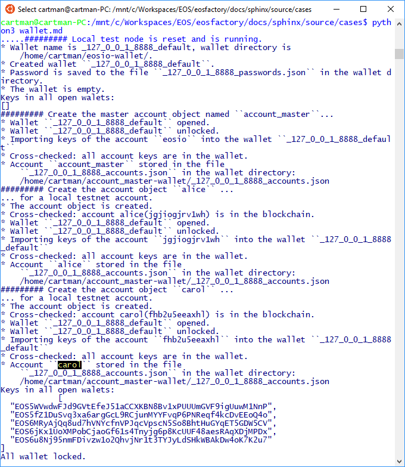
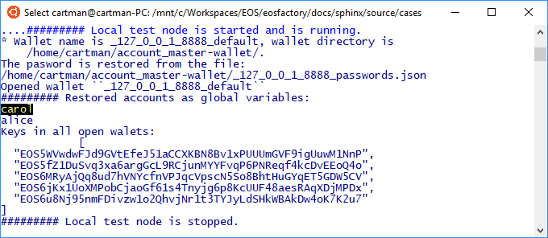

'''
# Wallet object

This file can be executed as a python script: 'python3 wallet.md'.

## Set-up

The set-up statements are explained at <a href="setup.html">cases/setup</a>.

```md
'''
from  eosfactory import *
Logger.verbosity = [Verbosity.INFO, Verbosity.OUT]
'''
```

## Case

The 'Wallet` class wraps EOSIO wallets. The 'Wallet' object keep account 
objects, presented at <a href="account.html">cases/account</a>.

It can be exactly one 'Wallet' object in the namespace. After the 'Wallet' 
singleton is created, it remains transparent to the script: usually, there 
is no need to refer to it.

Although the Factory manages only one 'Wallet` object at a time, it produces umerous wallet files in the wallet directory, that is where the KEOSD Wallet Manager keeps wallets. The wallet files are marked with prefixes -- either arbitrary, set by a particular test script -- or encoding the URL of the testnet active at the creation time.

*   Arbitrary prefixes mark wallets used for one-time tests; they are erased before repeating their tests.

*   Testnode prefixes are consequently used in context of their nodes; they keep Factory state between sessions.

*   Empty prefix (not implemented yet) marks wallets used with real EOSIO nodes.

For example, let us try with the local testnet:
```md
'''
restart()
reset([Verbosity.INFO])
wallet = create_wallet()
wallet.keys()
account_master_create("account_master")
account_create("alice", account_master)
account_create("bob", account_master)
account_create("carol", account_master)
wallet.keys()
wallet.lock_all()

stop()
'''
```


What has happened?

* The local node has restarted. Prior to the restart, the specifically marked wallet is deleted, together with other files hawing the same prefix: password file and account mapping file.
* The wallet object has been created.
* Its password has been stored to a file.
* An account object named 'account_master' has been created and placed in
    the wallet.

If we close the session, then open it again, and recreate the wallet, we can
expect that it opens without calling for password, having the same keys.

```md
'''
restart()
run([Verbosity.INFO])
create_wallet()
wallet.keys()   
stop()
exit()
'''
```



### Methods of the 'Wallet' class

We plan the Factory so that the singular wallet object is never referred to, in
usual scripts. However, the 'Wallet` class has several methods that are used
internally. Some of them are obvious:

* Open wallet.
* Unlock wallet.
* Keys in all open wallets.
* etc.

'''

