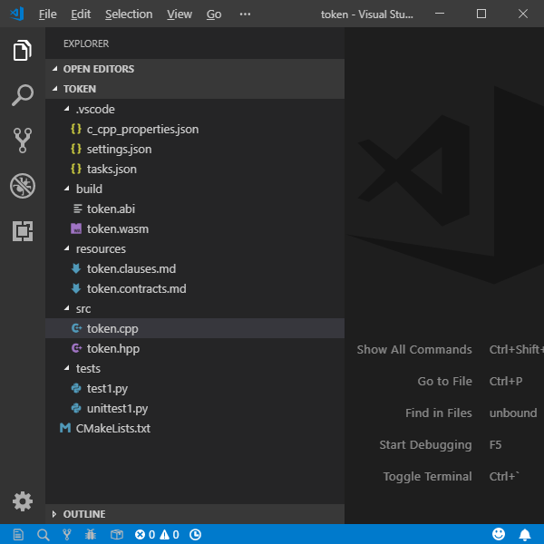
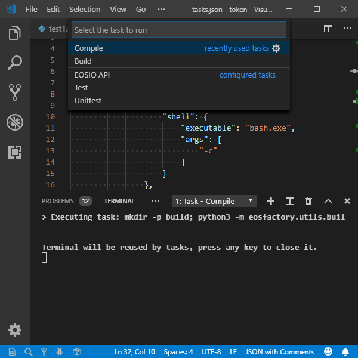
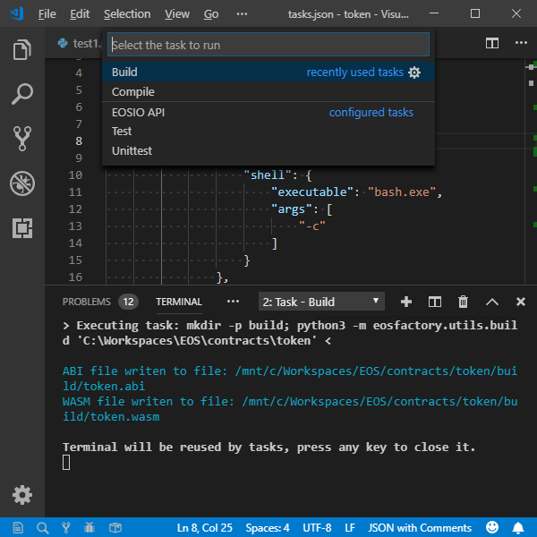
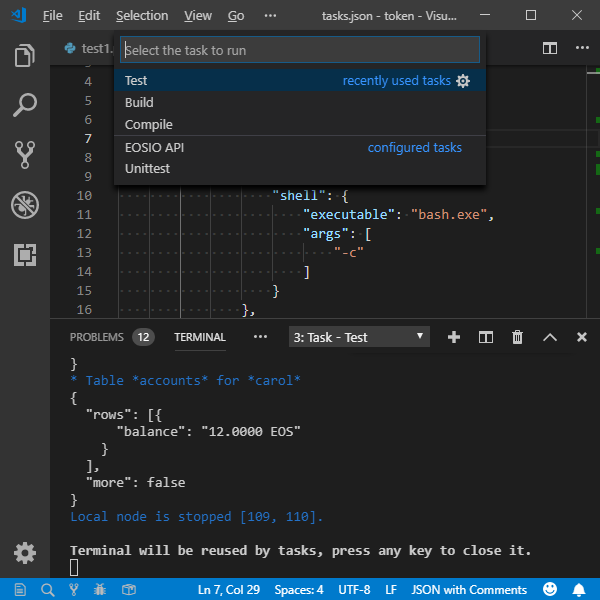

# Working with EOS Contracts using *EOSFactory* in *Visual Studio Code*

The purpose of this tutorial is to demonstrate how *EOSFactory* can be combined with [Visual Studio Code](https://code.visualstudio.com/) in order to streamline the process of working with EOS smart-contracts.

## Prerequisites

- This tutorial assumes that you have successfully installed *EOSFactory*. If it's not the case, please refer to [Installing *EOSFactory*](01.InstallingEOSFactory.html).

- We assume that you are familiar with the material covered in [Interacting with EOS Contracts in *EOSFactory*](02.InteractingWithEOSContractsInEOSFactory.html).

- We also assume you have [Visual Studio Code](https://code.visualstudio.com/) installed. If you are on Windows and run VSC for the first time, in order to get access to *Windows Subsystem for Linux* bash terminal inside VSC, navigate to `Preferences -> Settings` and overwrite the default configuration for the `terminal.integrated.shell.windows` option: <br><br>
    `
    "terminal.integrated.shell.windows": "C:\\Windows\\sysnative\\bash.exe"
    `<br><br>
Alternatively, you can execute the command `bash` in the terminal.

- Finally, we assume that you are familiar with the official [EOS Hello World tutorial](https://github.com/EOSIO/eos/wiki/Tutorial-Hello-World-Contract), as it presents the standard way to compile and deploy smart-contracts in EOS. What we present here is an alternative.

## Create a new smart-contract VSC project

In a bash terminal run the following command:

```bash
cd eosfactory
python3 -m eosfactory.create_project foo_bar hello_world
```

>**NOTE:** If you are on Windows and have not restarted your WSL bash terminal after *EOSFactory* installation, you'll need to do so before you execute this command (if you are using WSL bash terminal inside *Visual Studio Code*, restart your VSC instead).

The first parameter (in our case `foo_bar`) is the name of your contract. It can be any name you want, provided there are no spaces in it. Letters, numbers, underscores `_`, dots `.` and dashes `-` are allowed.

The second parameter (in our case `hello_world`) denotes the template from which the new contract will be created. As of now there are three templates to choose from (i.e. `hello_world`, `eosio_token` and `tic_tac_toe`), with more coming in the future. This parameter is optional, the default value is `hello_world`.

## Open the new project in *Visual Studio Code*

You can open the new project manually by launching VSC and navigating to the projects's folder.

Alternatively, you can add the `--vsc` option to the command and then VSC will launch automatically, already switched to the projects's folder, for example:

```bash
cd eosfactory
python3 -m eosfactory.create_project foo_bar hello_world --vsc
```

>**NOTE** With the WSL (Windows Subsystem Unix), VSCode starts as a Windows application. Therefore a result of the above call is strange if VSCode has not access rights to the contract workspace.<br>
The directory of the contract workspace can be seen and set with the command `python3 -m eosfactory.config --workspace`.

## Folder structure

Once the project is open in VSC, you'll see the following file structure:



What you get is a complete smart-contract workspace with clear separation between smart-contract source code, build output files and unit tests. Everything is set up and ready to be built and unit tested:

- `src` directory, the `cpp` files are there.
- `include` directory, the `hpp` files are there.
- `test` directory, test scripts are there.
- `ricardian` contains the Ricardian contract files.
- `.vscode` directory that contains *IntelliSense* definitions, task 
  definitions, etc.
- `CMakeLists.txt` file, CMake definitions.

>**NOTE:** You are free to change the literals, e.g. you can change the name of `test1` to some other name, but if you do so you'll also have to update both the `CMakeLists.txt` and `.vscode/tasks.json` files.

## Use *CMake* in *Visual Studio Code*

With *EOSFactory* you can use [CMake](https://cmake.org/) routines to compile, build and unit test a contract. 

First open a bash terminal inside VSC (navigate to `View -> Integrated Terminal`), and switch to the `build` folder:

```bash
cd build
```

#### Configure

To configure your project:

```bash
cmake ..
```

The output should look like this:

```bash
-- Configuring done
-- Generating done
-- Build files have been written to: /mnt/c/Workspaces/EOS/contracts/foo_bar/build
```

#### Build

To build your project:

```bash
make
```

The output should look like this:

```bash
Scanning dependencies of target wast
ABI file writen to file: 
    /mnt/c/Workspaces/EOS/contracts/foo_bar/build/foo_bar.abi
WASM file writen to file: 
    /mnt/c/Workspaces/EOS/contracts/foo_bar/build/foo_bar.wasm
Built target wast
```

>**NOTE:** If the `ABI` file already exists in the `src` folder (you should keep it there, if you prefer to create it manually instead of relying on the *EOSIO* toolset) *CMake* will skip the `ABI` file generation step and proceed with `WASM` file generation.

#### Unit tests

And finally, after your contract has been successfully built, invoke unit tests with this command:

```bash
ctest
```

The outcome of the unit test should look like this:

```bash
Test project /mnt/d/Workspaces/EOS/contracts/contract.name/build
    Start 1: test
1/2 Test #1: test .............................   Passed    9.96 sec
    Start 2: unittest
2/2 Test #2: unittest .........................   Passed    9.94 sec

100% tests passed, 0 tests failed out of 2

Total Test time (real) =  19.92 sec
```

And if you want to be more specific about which unit tests should be run, you can use the `-R` parameter which allows you to supply a regular expression indicating specific criteria regarding the names of the tests to be run, for example:

```bash
ctest -R ^test$
```

>**NOTE:** As you might have noticed, there are two types of unit tests: the standard ones (named *unittest1*, *unittest2*, etc) and ad-hoc ones (named *test1*, *test2*, etc). The reason for this duality is this: we find it useful to have standard unit tests to prove that things work as expected, and ad-hoc tests to investigate bugs and generally monitor the inner workings of a smart-contract. *EOSFactory* supports both, so you can choose whatever suits your needs.

Also, please note that an alternative way to run the tests is to invoke them as a Python executable file, for example, assuming bash in the root directory:

```bash
python3 tests/test1.py
```

```bash
python3 tests/unittest1.py
```

## Use automated tasks in *Visual Studio Code*

Running VSC automated tasks is an alternative to using *CMake* routines described in the previous section.

Also, by using automated tasks you can choose whether you just want to compile the code using the `CLANG` compiler or run a complete build with the `WASM` compiler.

The advantage of using the `CLANG` compiler (as opposed to the `WASM` compiler) is that it runs faster and does not involve the linking process. Thus most of the errors in a smart-contract's code can be spotted automatically by `CLANG`. 

To access automated task navigate to the `Tasks` top menu option:

- `Build` results in building the contract, with the `ABI` and `WASM`
  files going to the `build` directory.
- `Compile` results in compilation of the contract, without building
  (neither `ABI` nor `WASM` are produced), but code errors, if any,
  are listed.
- `Test` executes the `test1.py` script.
- `Unittest` executes the `unittest1.py` script.

- `EOSIO API` opens the [EOSIO documentation](https://developers.eos.io/eosio-cpp/reference).

#### Compile

To have your code compiled by the `CLANG` compiler navigate to `Terminal > Run Task > Compile`:



#### Build

To have your code built by the `WASM` compiler navigate to `Terminal > Run Task > Build`:



#### Test

To run ad-hoc unit tests navigate to `Terminal > Run Task > Test`:



#### Unit test

To run standardized unit tests navigate to `Terminal > Run Task > Unittest`:


## Use *IntelliSense* in *Visual Studio Code*

You can also make use of VSC [IntelliSense](https://code.visualstudio.com/docs/editor/intellisense) feature. Among other things, it allows you to inspect the context of any code element, including its definition and declaration.


>**NOTE:** For that to work you'll need to install the C/C++ IntelliSense extension in VSC.
