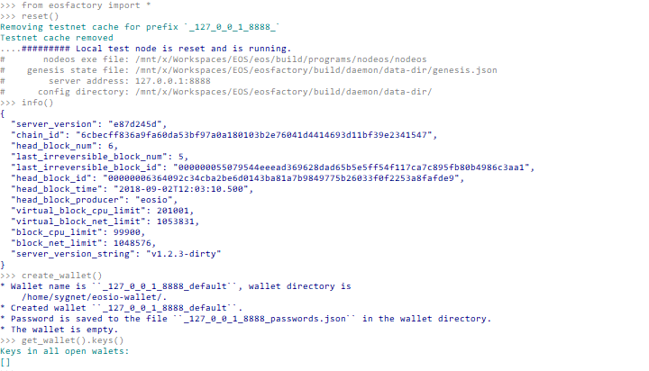
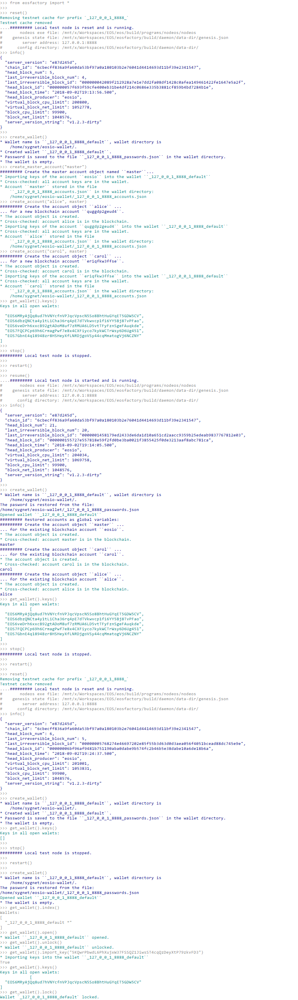

'''
# Wallet Class

This document demonstrates how the `Wallet` class works. We present how account objects can be preserved across separate Python sessions. Also, we discuss the `Wallet` class methods.

## Context

The `Wallet` class wraps an *EOSIO* wallet. An instance of the class, i.e. a `Wallet` object keeps track of `Account` objects.

The `Wallet` class is a singleton, so there needs to be exactly one `Wallet` object in the namespace. After the `Wallet` is created with the `create_wallet()` command, it remains transparent to the script, yet usually there is no need to access it directly.

Although *EOSFactory* manages only one `Wallet` object at a time, it produces numerous wallet files in `~/eosio-wallet`, i.e. in the location where the `keosd` wallet manager stores its wallets.

The wallet files are marked with prefixes which are encoding the URL of the active testnet (i.e. the one which is active when the `create_wallet()` command is executed), for example: `_127_0_0_1_8888_default.wallet` or `_88_99_97_30_38888_default.wallet`.

## Setup

Create a new Python session:

```
$ python3
```
And import *EOSFactory* API:

```
'''
from eosfactory.eosf import *
'''
```

## Use Case

#### Create a new wallet

First, lets's start a local testnet:

```
'''
reset()
info()
'''
```

Next, create a wallet, then create a couple of accounts and finally let the `Wallet` object list the private keys associated with those accounts:
```
'''
create_wallet()
create_master_account("master")
create_account("alice", master)
create_account("carol", master)
get_wallet().keys()
'''
```

Here is the expected outcome:


What has happened?

* The wallet object is created, with its password is stored locally in a file.
* An account object named `master` is created and its keys are stored in the wallet.
* Similarly, account objects named `alice` and `carol` are created and their keys are stored in the wallet.

#### Resume the testnet

Reboot *EOSFactory* session:

```
'''
reboot()
'''
```

Resume the testnet:

```
'''
resume()
info()
'''
```

When you run the `create_wallet()` command, *EOSFactory* will recreate the existing wallet, including the private keys we created in the previous session:

```
'''
create_wallet()
get_wallet().keys()
'''
```

Here is the expected outcome:


#### Reset the testnet

Reboot *EOSFactory* session:

```
'''
reboot()
'''
```

This time we reset the testnet (as opposed to just resuming it):

```
'''
reset()
info()
'''
```

When you run the `create_wallet()` command, *EOSFactory* will lose track of the private keys, as the wallet is created from scratch. This is because the local testnet was reset, not resumed.

```
'''
create_wallet()
get_wallet().keys()
'''
```
You should get output similar to this:



#### Methods of the Wallet class

As we mentioned before, when working with unit tests you should never need to access the `Wallet` object directedly. 

However, if you do, below there is a list of methods available in the `Wallet` class.

Reboot *EOSFactory* session:

```
'''
reboot()
'''
```

Then create a `Wallet` object:

```
'''
create_wallet()
'''
```

And execute the following methods of the `Wallet` class:

```
'''
get_wallet().index()
get_wallet().open()
get_wallet().unlock()
get_wallet().import_key("5KQwrPbwdL6PhXujxW37FSSQZ1JiwsST4cqQzDeyXtP79zkvFD3")
get_wallet().keys()
get_wallet().lock()
'''
```

You should get output similar to this:


Finally, exit Python CLI:

```
'''
exit()
'''
```

## Test Run

The examples presented in this document can be executed as a Python script:
```
python3 docs/sphinx/source/cases/02_wallet/case.md
```
You should get output similar to this:



'''