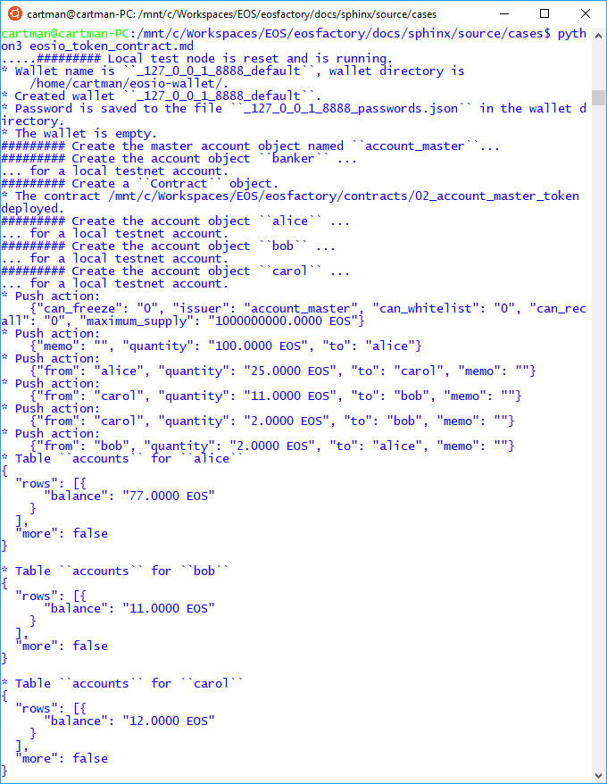

'''
# Eosio Token Contract

This file can be executed as a python script: 'python3 eosio_token_contract.md'.

## Set-up

The set-up statements are explained at <a href="setup.html">cases/setup</a>.

```md
'''
from eosf import *
Logger.verbosity = [Verbosity.INFO, Verbosity.OUT]
CONTRACT_DIR = "02_eosio_token"
'''
```

### `Wallet` object

Create the singleton wallet object. The object represents a physical wallet,
managedby  the KEOSD:

```md
'''
reset()
create_wallet()
'''
```
### `account master` object

Create the `account_master` account that has the authority of making changes in the blockchain:

```md
'''
create_master_account("account_master")
'''
```
### Contract managing account

Any smart contract has to have its owner account that executes its actions. Create the "banker" account, and deploy a contract derived from the `eosio.token` code:

```md
'''
create_account("banker", account_master)
Contract(banker, CONTRACT_DIR).deploy()
'''
```
### Acting accounts

Create accounts named `alice`, `bob` and `carol` that can interact with the `banker`:

```md
'''
create_account("alice", account_master)
create_account("bob", account_master)
create_account("carol", account_master)
'''
```

## Case

Use the `push_action` method of the `banker account to execute actions of the contract:

* let eosio deposit an amount of 1000000000.0000 EOS there;
* transfer some EOS to the 'alice' account.

```md
'''
banker.push_action(
    "create", 
    {
        "issuer": account_master,
        "maximum_supply": "1000000000.0000 EOS",
        "can_freeze": "0",
        "can_recall": "0",
        "can_whitelist": "0"
    }, [account_master, banker])

banker.push_action(
    "issue",
    {
        "to": alice, "quantity": "100.0000 EOS", "memo": ""
    },
    account_master)
'''
```

Execute a series of transfers between the accounts. Use the 'push_action' 
method of the contract account:

```md
'''
banker.push_action(
    "transfer",
    {
        "from": alice, "to": carol,
        "quantity": "25.0000 EOS", "memo":""
    },
    alice)

banker.push_action(
    "transfer",
    {
        "from": carol, "to": bob, 
        "quantity": "11.0000 EOS", "memo": ""
    },
    carol)

banker.push_action(
    "transfer",
    {
        "from": carol, "to": bob, 
        "quantity": "2.0000 EOS", "memo": ""
    },
    carol)

banker.push_action(
    "transfer",
    {
        "from": bob, "to": alice, \
        "quantity": "2.0000 EOS", "memo":""
    },
    bob)

'''
```

To see the records of the accounts, use the 'table' method of the contract
account:

```md
'''
table_alice = banker.table("accounts", alice)
table_bob = banker.table("accounts", bob)
table_carol = banker.table("accounts", carol)
'''
```

### Test run

In an linux bash, change directory to where this file exists, that is the 
directory 'docs/source/cases' in the repository, and enter this command:

```md
$ python3 eosio_token_contract.md
```

We expect that you get something similar to what is shown in the image below.



'''