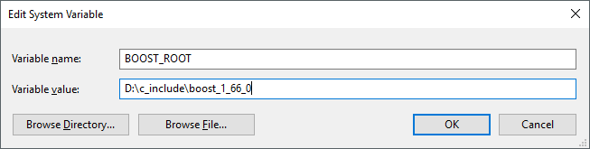

# Tokenika's alternative for *eosc* command line interface


## Rationale

For those less familiar with EOS codebase, `eosc` is the official CLI (Command Line Interface) for EOS.

When working with EOS smart-contracts, we've found that `eosc` has some inconvenient limitations:

* Firstly, it's hard to use `eosc` programmatically, as it doesn't offer an API.
* Secondly, it is quite heavyweight in terms of external dependencies, as it's tightly connected to the entire EOS codebase.
* Also, it is not ready to be used in Windows environment, while our plans include opening up EOS for smart-contract development on Windows.

It could be enough for us to develop a minimal C++ library acting as an EOS API and implementing the commands supported by `eosc`. However, it was a short step to provide such a library with a command line interface, and thus create a full-blown `eosc` replacement. Furthermore, to make our work competitive to the original `eosc`, we have added a richer & more useful command option list. 

For obvious reasons everything we do is open source. We dare to hope that this little work of ours could become an interesting alternative to the original `eosc` CLI, and maybe one day be included as part of EOS codebase.

## Comparison

Our version of `eosc` covers the same functionality as the original `eosc` but it's more user friendly and offers a wider selection of options.

Let's compare the `get block` command help:
```
./eosc get block -h
```
The original `eosc` response looks like this:
```
ERROR: RequiredError: block
Retrieve a full block from the blockchain
Usage: ./eosc get block block
Positionals:
block TEXT                  The number or ID of the block to retrieve
```
Whereas our `eosc` response looks like this:
```
Retrieve a full block from the blockchain
Usage: ./eosc get block [block_num_or_id][Options]
Usage: ./eosc get block [-j {"block_num_or_id":*}][OPTIONS]

Options:
  -n [ --block_num ] arg  Block number
  -i [ --block_id ] arg   Block id
  -h [ --help ]           Help screen
  -j [ --json ] arg       Json argument
  -v [ --received ]       Print received json
  -r [ --raw ]            Raw print
  -e [ --example ]        Usage example
```
And now let's compare the `get block` command usage, e.g.:
```
./eosc get block 25
```
The original `eosc` response looks like this:
```
{
  "previous": "00000018b5e0ffcd3dfede45bc261e3a04de9f1f40386a69821780e063a41448",
  "timestamp": "2017-11-29T09:50:03",
  "transaction_merkle_root": "0000000000000000000000000000000000000000000000000000000000000000",
  "producer": "initf",
  "producer_changes": [],
  "producer_signature": "2005db1a193cc3597fdc3bd38a4375df2a9f9593390f9431f7a9b53701cd46a1b5418b9cd68edbdf2127d6ececc4d66b7a190e72a97ce9adfcc750ef0a770f5619",
  "cycles": [],
  "id": "000000190857c9fb43d62525bd29dc321003789c075de593ce7224bde7fc2284",
  "block_num": 25,
  "refBlockPrefix": 623236675
}
```
Whereas our `eosc` response is less verbose by default to make it more readable:
```
## block number: 25
## timestamp: 2017-11-29T09:50:03
## ref block prefix: 623236675
```
But you can make it verbose, if you need it:
```
./eosc get block 25 --received
```
```
{
    "previous": "00000018b5e0ffcd3dfede45bc261e3a04de9f1f40386a69821780e063a41448",
    "timestamp": "2017-11-29T09:50:03",
    "transaction_merkle_root": "0000000000000000000000000000000000000000000000000000000000000000",
    "producer": "initf",
    "producer_changes": "",
    "producer_signature": "2005db1a193cc3597fdc3bd38a4375df2a9f9593390f9431f7a9b53701cd46a1b5418b9cd68edbdf2127d6ececc4d66b7a190e72a97ce9adfcc750ef0a770f5619",
    "cycles": "",
    "id": "000000190857c9fb43d62525bd29dc321003789c075de593ce7224bde7fc2284",
    "block_num": "25",
    "refBlockPrefix": "623236675"
}
```
You can make it both verbose and unformatted:
```
./eosc get block 25 --received --raw
```
```
{"previous":"00000018b5e0ffcd3dfede45bc261e3a04de9f1f40386a69821780e063a41448","timestamp":"2017-11-29T09:50:03","transaction_merkle_root":"0000000000000000000000000000000000000000000000000000000000000000","producer":"initf","producer_changes":"","producer_signature":"2005db1a193cc3597fdc3bd38a4375df2a9f9593390f9431f7a9b53701cd46a1b5418b9cd68edbdf2127d6ececc4d66b7a190e72a97ce9adfcc750ef0a770f5619","cycles":"","id":"000000190857c9fb43d62525bd29dc321003789c075de593ce7224bde7fc2284","block_num":"25","refBlockPrefix":"623236675"}
```
You can supply the arguments in json format:
```
./eosc get block --json '{"block_num_or_id":"56"}'
```
```
##         block number: 56
##            timestamp: 2017-11-29T10:02:18
##     ref block prefix: 273573026
```
And finally, you can use it in example mode:
```
./eosc get block --example
```
```
Invoke 'get_info' command:
get_info get_info;

{
    "head_block_num": "9939",
    "last_irreversible_block_num": "9924",
    "head_block_id": "000026d378f90b5d25dcf962fc44d637872218e5f826420a342f05a534d50bfc",
    "head_block_time": "2017-12-01T18:57:42",
    "head_block_producer": "initr",
    "recent_slots": "0000000000000000000000000000000000000000000000000011111111111111",
    "participation_rate": "0.21875000000000000"
}

Use reference to the last block:
GetBlock GetBlock(
  get_info.get<int>("last_irreversible_block_num"));

{
    "previous": "000026c35fb5d442be6d4e81a1347cce2c0184c4c2047d9e6dfc78b3bb325ac2",
    "timestamp": "2017-12-01T17:01:09",
    "transaction_merkle_root": "0000000000000000000000000000000000000000000000000000000000000000",
    "producer": "initn",
    "producer_changes": "",
    "producer_signature": "1f6984d14ee40ed9806ae14aa96531d874fc3417bf3f1b66c4b1d9c9402f3f90ef07c4523eb9a639ad632c181580aeb051385d718dc59ecc54d0f0e5de012b540f",
    "cycles": "",
    "id": "000026c44a2e8075a5b92813869bfb67b72b79ccb3f2e40ad815603c04d2fafd",
    "block_num": "9924",
    "refBlockPrefix": "321436069"
}
```

# Build

## Ubuntu

#### Dependencies

First, make sure you have Boost 1.62 (or higher) installed:
```
dpkg -s libboost-dev | grep 'Version'
```
In case you need to install it, run this command:
```
sudo apt-get install libboost-all-dev
```
#### Source code

Navigate to a location of your choice on your machine and clone the repository:

```
git clone https://github.com/tokenika/eosc.git
```
#### Compilation

Navigate to the `eosc/eosc` folder and create a new folder named `build`:

```
cd eosc/eosc/
mkdir build
cd build
```
Run CMake:
```
cmake ..
```
Make sure there are no errors, and then preceed with the actual compilation:
```
make
```
As the result of the compilation, you should have those two files in the `build` folder:
* `eosc` is the CLI executable
* `eosclib\libeosclib.a` is the underlying library acting as an EOS API

#### Testing on remote sever

Open a terminal window, navigate to the `build` folder and run `eosc`:
```
./eosc 198.100.148.136:8888 get info
```
The above command will connect to one of our test-net servers. Alternatively, you can use the placeholder `tokenika` instead of  `198.100.148.136:8888`:
```
./eosc tokenika get info
```

#### Testing on localhost

If you have complied the entire EOS codebase and have `eosd` running on your machine, you can also test our `eosc` locally:
```
./eosc localhost get info
```

### Windows

#### Visual Studio IDE

On Windows we recommend using MS Visual Studio 2017. The *Community* edition is fully functional and is [available for free](https://www.visualstudio.com/).

#### Dependencies

Make sure you have Boost 1.66 available on your machine. If not, you can download the source code from [the official webpage](http://www.boost.org/users/download/) or use the [pre-built Windows binaries](https://sourceforge.net/projects/boost/files/boost-binaries/) (make sure to use the [boost_1_66_0-msvc-14.1-64]( https://sourceforge.net/projects/boost/files/boost-binaries/1.66.0/boost_1_66_0-msvc-14.1-64.exe/download) version).

Set up a system variable named  `BOOST_ROOT` pointing at your Boost directory. In our case it looks like this, but yours will most probably be different, depending on your Boost library location:



#### Source code

Navigate to a location of your choice on your machine and clone the repository:

```
git clone https://github.com/tokenika/eosc.git
```

#### Compilation

We've created a dedicated MS Visual Studio 2017 solution project - it's located in the  `eos_visual_studio` folder. Open the `eosc.sln` file in Visual Studio, and then build both the `eoscLib` (the library for EOS API) and the `eosc` executable.

#### Testing on remote sever

Open the command prompt, navigate to the `eosc_visual_studio` folder and run `eosc`:
```
eosc 198.100.148.136:8888 get info
```
The above command will connect to one of our test-net servers. Alternatively, you can use the placeholder `tokenika` instead of  `198.100.148.136:8888`:
```
eosc tokenika get info
```

## Library

In our view, the real value is the library that's behind our version of `eosc`.

Let you see a code snippet:
```
#include <stdio.h>
#include <stdlib.h>
#include <iostream>
#include <string>

#include "eosclib/eosc_get_commands.hpp"

int main(int argc, char *argv[])
{
  using namespace tokenika::eosc;

  EoscCommand::host = "198.100.148.136";
  EoscCommand::port = "8888";

  ptree getInfoJson;

  // Invoke 'GetInfo' command:
  GetInfo getInfo(getInfoJson);
  cout << getInfo.toStringRcv() << endl;

  ptree getBlockJson;

  // Use reference to the last block:
  getBlockJson.put("block_num_or_id",
    getInfo.get<int>("last_irreversible_block_num"));
  GetBlock getBlock(getBlockJson);
  cout << getBlock.toStringRcv() << endl;

  return 0;
}
```
Here is the print-out:
```{
    "previous": "000028716589219b442afe9d140bc28eff4335aecd37d519b0105fca4c8e4a3f",
    "timestamp": "2017-12-01T19:18:27",
    "transaction_merkle_root": "0000000000000000000000000000000000000000000000000000000000000000",
    "producer": "inith",
    "producer_changes": "",
    "producer_signature": "1f510dec0bcd85847b7bead61f6deee7a5fb4108745e6ceaaa81804fe4700b561f7ca3f3f26f56fbfaf1e10fd3ba2999f8cbe165fd391b023334badcf894ba54dc",
    "cycles": "",
    "id": "00002872be99d0133ea104b42b771f3c7c2ea3736263dc9db3719728a2776976",
    "block_num": "10354",
    "refBlockPrefix": "3020202302"
}
```